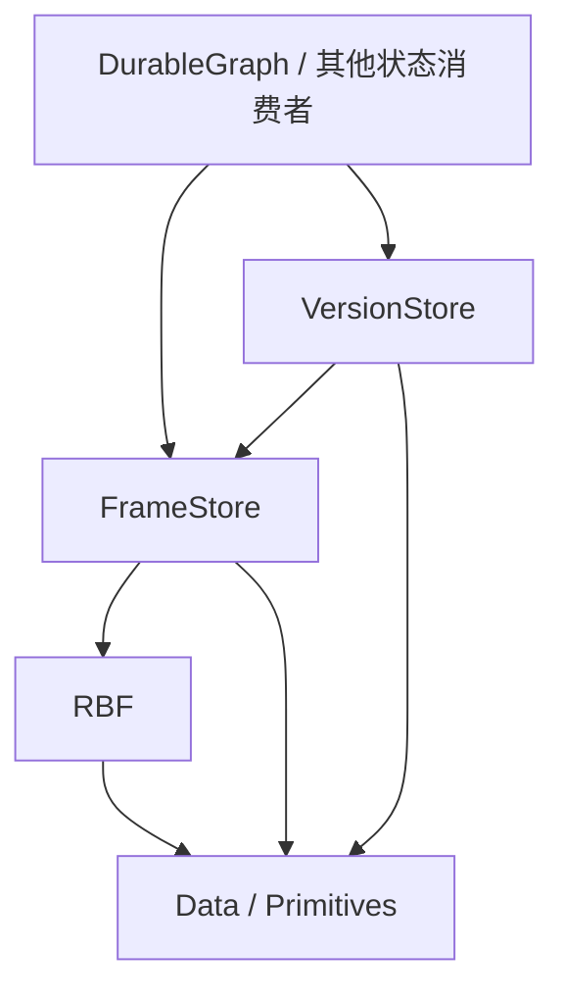

# S0：总体边界与决策

日期：2026-10-03；2026-10-04 补充持久分配器、提交对象与发布顺序的职责边界。状态：**会话方向已确认；S2–S6 技术候选仍为 Draft；参考依赖拆分 Accepted**。
本文件记录本次用户已表达的决策。规范写法依 [规范约定](../spec-conventions.md)。API/wire 的具体选择由后续阶段细化。

## term `FrameStore` 中性的 Frame 存储库

新项目 `Atelia.FrameStore` 管理带不透明地址的不可变 binary frames，对外提供持久分配、随机读取、批量地址预约及同步耐久确认。文件选择、物理相邻关系和写入调度属于内部实现；普通分配合同不提供业务上的全局顺序。

## term `VersionStore` 根发布与命名版本控制库

新项目 `Atelia.VersionStore` 管理中性的不可变提交对象，并通过 ref、branch、tag 发布和命名提交。提交祖先关系与 ref 发布历史分别表达；状态的构建、解释与业务合法性属于消费者。

## term `Frame-Address` 中性帧地址

FrameStore 坐标系中定位一个 frame 的地址，候选代码名为 `FrameAddress`。它不内含 EventFrame、Parent、图节点或应用根的业务定义；解释时必须有明确的存储上下文。

## term `Publication` 发布

一次完整发布记录使某个 ref 指向提交，或使名称绑定到提交。提交对象已经存在、其依赖已耐久及它被某个对象发布分别具有自己的资格。

## term `Commit-Object` 不可变提交对象

包含中性 StateRoot 地址和逻辑 parent 引用的不可变对象，由 VersionStore 编码，保存在 data FrameStore 中。CommitAddress 是该帧地址的窄类型，不是 ref revision 或发布尝试身份；具体合同由 S4 形成。

## 已确认决策

### decision [S-NEW-STORAGE-PROJECTS] 新能力由新项目承载

MUST 新建 FrameStore、VersionStore 两个生产项目及分别配套的单元测试项目。
新栈 MUST 不依赖 `Atelia.RbfSegmentStore` 或 `Atelia.EventJournal`。二者在 main 保留为冻结参考，维护和公开交付归 `RBF1` 分支；不得借本方案向旧库加入新职能或替换其存储实现。

2026-10-04 用户确认：main 的旧源码、测试和 toolkit 保留原目录，底层 Rbf/Data/Primitives 精确 PackageReference `[0.2.0-rbf1-preview.1]`，不跟随 main 底层源码、不新增运行时适配。当前 solution 保留新旧两组测试；主线 pack 仅 Primitives → Data → Rbf，两个旧库 IsPackable=false。实施与 assets/包验收见[参考代码过渡方案](../rbf1-reference-transition.md)，这不代表 FrameStore/VersionStore 已创建。

### decision [S-RBF-ATOMIC-FRAMES] 接受 RBF 帧原子模型

新栈 MUST 使用 RBF3 普通可写打开的物理恢复能力，以恢复后存在的完整事实帧构建状态。下游 MUST 不通过残缺尾帧推断业务过程或保留部分业务结果。
单帧原子性限于 [RBF 当前恢复模型](../Rbf/rbf-interface.md)；成功 EndAppend、DurableFlush 返回及发布成功不得合并为同一事件。

### decision [S-ROOT-PUBLISHED-LAST] 状态根最后发布

协议 MUST 先完成状态帧及提交对象，再确认全部新增依赖耐久，随后追加单条发布记录、确认其耐久，最后安装内存状态。发布旧提交可以复用其既有帧。
消费者 MUST 保证依赖闭包由此前已耐久帧和本次完成、确认耐久的新增帧组成。通用库不得声称可从任意 opaque payload 自动证明该闭包。

### decision [S-NEUTRAL-FRAME-TARGETS] 根目标使用中性地址（DEPRECATED）

本条的“直接发布状态根”范围由 `[S-NEUTRAL-STATE-ROOTS]` 与 `[S-VS-COMMITS-SEPARATE-REFS]` 替代。保留锚点用于追溯早期草案。

### decision [S-NEUTRAL-STATE-ROOTS] 状态根保持中性

提交对象 MUST 用 @`Frame-Address` 引用 StateRoot，不要求 EventFrame tag、EventFrameHeader、应用 Parent、graph schema 或业务 codec。VersionStore 自己定义的提交 parent 不解释应用状态。VersionStore 不调用消费者业务回调来定义发布事实。

### decision [S-FS-OPAQUE-ALLOCATION] 分配与读取不依赖物理布局

2026-10-04 用户确认本轮分析与修订方向：FrameStore MUST 对普通调用方隐藏文件选择及物理地址关系；业务引用 MUST 通过地址表达，不得用地址大小、相邻关系或分配先后推断业务关系。
不透明分配不自动承诺任意完成次序、并发 Builder、free/GC 或帧搬迁。首版内部可以继续单 active 文件、串行 RBF 追加；这些是实现与准入限制。

### decision [S-VS-COMMITS-SEPARATE-REFS] 提交关系与发布历史分离

VersionStore MUST 区分不可变提交、应用状态根及 ref revision。branch/tag 以提交为目标；提交通过逻辑地址引用 parent，不依赖帧物理排列。
一次 ref 更新、tag 创建或名称绑定 MUST 有完整持久发布事实；tag 查询无序不免除其创建协议。具体控制日志能力、单 parent 首版及 codec 仍由后续阶段审定。

### decision [S-LEGACY-READ-ONLY] 主线旧格式只读且无转写

主线 RBF 的 RBF1 MUST 保留底层只读兼容；新栈写入 MUST 使用纯 RBF3 新文件。新栈不向旧库追加、不在一个库内建立 RBF1/RBF3 混合续写、不进行 RBF1 → RBF3 转写或旧地址迁移。本条不限制 RBF1 维护线及其固定包按原合同写入旧栈。
旧消费者继续按各自固定版本及原支持范围运行。RBF 可读兼容不等于 FrameStore 能直接打开旧 EventJournal/SegmentStore 目录；新栈有自己的格式身份。

### decision [S-STAGES-FLOW-FORWARD] 阶段依赖单向

后续阶段 MUST 消费前序阶段已明确的合同；前序层的运行时正确性不得依赖后序层存在。下游发现下层缺口时，修改下层合同并复验受影响阶段，不在下游复制实现知识。

### decision [S-RBF-SIZED-APPEND-SPLIT-LENGTHS] 已知尺寸追加分别声明 payload 和 meta 长度

2026-10-04 用户确认：新 RBF `out ticket` 入口 MUST 接收分立的 payloadLength、tailMetaLength，与 MeasureWriteSize 的输入一致。
Begin 固定两部分逻辑长度，正常 EndAppend(tag) 使用声明的 meta 长度；保持现有紧密存储和一个 PayloadAndMeta writer。本决策不要求分别对齐或改变 wire-format。
具体签名、可纠正拒绝和取消后的 ticket 资格见已定稿的 [S1](01-rbf-sized-append.md)。S2/S3 规划和执行均保留这两个输入，不只保留求和结果。

## 推荐职责与依赖（候选）

箭头表示 C# 项目依赖；Primitives/Data 的直接引用按实际使用决定。新生产库不得引用 atelia 业务项目、其 Analyzer 或旧存储库。旧栈依赖闭包保持独立。

| 事实或资格 | 唯一负责层 | 其他层的使用方式 |
| --- | --- | --- |
| RBF profile、padding、长度、CRC、尾部恢复 | RBF | 调用公共 API，消费恢复结果 |
| store 身份、文件定位、FrameAddress、完成资格 | FrameStore | 用不透明地址及生命周期合同访问 |
| 有序帧日志的位置、真实主链与扫描边界 | FrameStore 项目内的窄日志能力 | 调用方显式选用日志合同，普通分配不继承顺序 |
| 本 owner 的全部完成输出已耐久 | FrameStore | 同步 barrier 返回后才尝试发布，不能推导业务闭包 |
| 某根是否构成合法状态、全部引用是否已覆盖 | 消费者中层 | 构建完成后选择根并准备发布 |
| 提交 codec、parent 关系与提交读取 | VersionStore | 消费者取得 StateRoot，祖先遍历与 ref 历史分开 |
| 发布顺序、ref 身份与 revision、branch/tag 绑定 | VersionStore | 消费者查询或发布提交，不比较物理地址 |
| locator、snapshot、查询索引、缓存 | 其所属存储层 | 从事实重建，不能制造新的业务发布 |
| 完整历史/图语义健康 | 显式 audit / 消费者 validator | 不由普通 Open 成功代替 |

### 当前技术候选：分配器与窄日志能力

FrameStore 首版后端继续单 active 文件并封存历史文件；普通 API 是无业务顺序的分配器。S2 同时形成窄的 `FrameLog` 候选：显式提供追加顺序、真实主链回放与受证扫描边界，和分配器共用底层实现，但不允许可绕过日志的写入口。不增加第三个生产项目或通用多流调度平台。

VersionStore **借入一个 data FrameStore，拥有一个私有 control FrameLog**。状态根、提交及其 parent 地址在 data 上下文解释；发布 token 在 control 上下文解释。两者隔离并持久绑定身份。FrameLog 的类名、factory 与格式门仍为候选，不将随机分配器的任意枚举冒充控制日志。

提交候选首版包含 StateRoot 和可空的单 parent；branch 可以发布既有提交，tag 固定绑定提交。全部新增依赖属于借入的 data owner。PreparedPublication.Commit 内同步确认它的全部完成输出，然后追加、确认控制记录；不向调用方传递可复用 `DurabilityReceipt`。消费者继续保证 opaque 状态闭包。

稳定 ref、CAS revision 和发布尝试共用一种控制记录 token 的表示。Prepare 在业务输出前把 token 交给调用方；实际发布是一条控制记录。名称核心先完成，复杂索引与完整工具产品不作为第一次根发布的前置。

控制流分离解决大量 data 分配干扰控制回放的问题，**不等于已取得有界打开资格**。第一片允许完整控制回放；snapshot 的规模合同另行审定。采用双上下文不把单帧原子性扩大成两个 owner 的原子事务。

VersionStore 内部 ref/name 投影安装与消费者安装应用状态分别负责。发布耐久后前者失败仍保留 Confirmed 并停用库实例；应用安装失败时，从已发布提交取得状态根重新加载，不撤销发布、不要求业务 callback。

2026-10-03 审阅中的“每实例单流、ref 直接指向 root”是历史候选；本轮按上述边界修订，不能将旧审阅结论作为当前全部合同已经复核的证据。

## 故障模型与建议范围

建议首版为单 driver 串行操作、append-only、显式只读打开、进程终止及部分写入模型。只读入口继承 RBF 的只验证、不修尾行为；可写入口接受物理恢复。使用读写模式不能改变内容损坏的判定。

IO/发布尝试后结果可能 Unknown；完整记录可在重开后存在。新栈保留查询结果所需的稳定身份，不依据原异常假设失败，也不盲重试。已知损坏不能通过回退到更早根来掩盖。

多 writer、跨实例实时 CAS、在线外部改写、GC/compaction、跨库事务及更强的断电模型属于单独需求；本轮阶段草案先覆盖同一存储上下文中的完整事实和有序发布。

## 旧库维护边界

当前 [根 README](../../README.md) 区分 main RBF3 新栈、main 冻结参考和已公开 RBF1 系列。[历史调查](../Rbf/rbf3-adaptation-baseline-investigation.md)记录旧源码直接跟随 RBF3 的编译/语义断点，不作为本轮依赖拆分测试结果。

旧栈维护首先选定 RBF1 分支中受支持的具体源码/包基线，再修复该基线的问题；main 仅保留冻结参考及独立回归。不把新栈自动恢复、批次或版本协议写回旧库，也不通过 `out _` 或其他运行时适配把旧 strict 打开改成 RBF3 恢复打开。

本轮按[过渡方案](../rbf1-reference-transition.md)冻结底层三个公开包，已 Accepted。Release solution build、完整 solution `--no-build` 1525/1525、每组实际 assets 及 W: 三包候选消费均已核对，来源见[验收记录](../rbf1-reference-transition.md#6-验收记录)；没有删除旧项目或跳过测试。旧库继续保留但 IsPackable=false。本轮不切换消费应用、不迁移磁盘数据。

## 当前已证实与未证实

| 事项 | 证据状态 |
| --- | --- |
| RBF3 create/open/recovery 及串行、资源异常边界 | 当前 [接口规范](../Rbf/rbf-interface.md)和 [70d1009 随附验收](../Rbf/rbf3-review-repairs-acceptance.md)；本次未重跑 |
| 精确尺寸公共 API、提前 ticket Builder、格式投影 | [S1](01-rbf-sized-append.md) 已 Accepted；实现 `8ab98bf`、RBF 818/818 与 W: public 源码消费等身份见[阶段验收](01-rbf-sized-append-acceptance.md) |
| main 参考依赖拆分及三包交付入口 | [过渡验收](../rbf1-reference-transition.md#6-验收记录) Accepted；1525/1525、七个旧栈 assets 图及 `4db3b8f` 的 W: 三包候选消费通过，不重标 S1 历史结果 |
| 新 FrameStore / VersionStore 与其测试项目 | 尚未创建 |
| 新根发布模型 | 本次需求与候选设计，尚无实现证据 |
| DurableGraph 当前接口及接入 | 2026-10-04 已定位兄弟仓；生产代码仍使用未知尺寸 Begin/End，无新 API 接入证据，不以历史 tag 文档代替实证 |

## S0 出口

会话已确认新项目、旧库维护边界、RBF 恢复方向、不透明分配、中性状态根、提交与发布历史分离及最后发布。
S1 的单文件尺寸和 ticket 合同已实施并独立验收为 Accepted。S2–S6 仍是 Draft，具体 wire、类名、方法签名及性能预算按各阶段阻断项细化；本片不代表新库或下游适配已完成。
