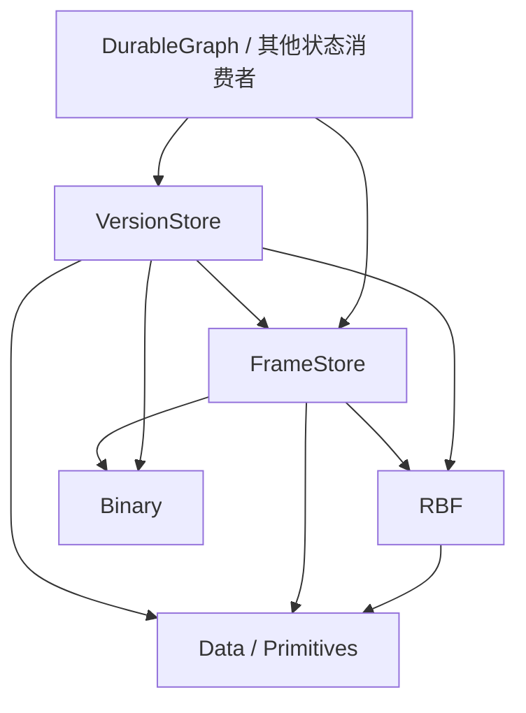

# S0：总体边界与决策

日期：2026-10-03–10 逐步确认 FrameStore 核心、RootMap 发布与 ForkOrigin；2026-10-10 新增 FrameAddress 变长 codec，并采用无 branch 名称、持久预留低号区、自动/预留区指定创建及单文件 ref 发布。状态：**会话方向已确认；S2/S3 独立源码验收 Accepted，新增地址能力单独验证；S4–S6 仍 Draft，VersionStore 尚未实施；参考依赖拆分 Accepted**。
本文件记录本次用户已表达的决策。规范写法依 [规范约定](../spec-conventions.md)。API/wire 的具体选择由后续阶段细化。

## term `FrameStore` 中性的 Frame 存储库

新项目 `Atelia.FrameStore` 管理带不透明地址的不可变 binary frames，对外提供三种单帧追加入口、提前地址、随机读取及同步耐久确认。文件选择、物理相邻关系和写入调度属于内部实现；普通分配合同不提供业务上的全局顺序。

## term `VersionStore` 基于 ref 身份的根发布与版本控制库

新项目 `Atelia.VersionStore` 发布完整 `string => FrameAddress` 字典快照。ref 是以稳定 RefId 定位的可更新字典，tag 是命名不可变字典；库不提供 branch 名称或 alias。应用自行管理语义/名称/富元数据到 RefId 的映射并解释 Key，一次快照可选择多个树/图的根，无独立 Commit 或通用 parent。

## term `Frame-Address` 中性帧地址

FrameStore 坐标系中定位一个 frame 的地址，候选代码名为 `FrameAddress`。它不内含 EventFrame、Parent、图节点或应用根的业务定义；解释时必须有明确的存储上下文。

## term `Publication` 发布

一次完整发布记录整体替换 ref 根字典，或建立不可变 tag。数据帧完成、依赖耐久、发布记录完成与调用方确认分别有各自资格。

## term `Root-Map` 完整根地址字典

候选代码名 RootMap，内容为 `string => FrameAddress`。字典按值保存，Key 唯一；空字典是合法快照，不等于对象不存在。所有地址解释于 VersionStore 绑定的一个 data FrameStore；应用状态、工具意图、随机状态、轨迹与业务谱系保存在其指向的数据中。

## 已确认决策

### decision [S-NEW-STORAGE-PROJECTS] 新能力由新项目承载

MUST 新建 FrameStore、VersionStore 两个生产项目及分别配套的单元测试项目。
新栈 MUST 不依赖 `Atelia.RbfSegmentStore` 或 `Atelia.EventJournal`。二者在 main 保留为冻结参考，维护和公开交付归 `RBF1` 分支；不得借本方案向旧库加入新职能或替换其存储实现。

2026-10-04 用户确认：main 的旧源码、测试和 toolkit 保留原目录，底层 Rbf/Data/Primitives 精确 PackageReference `[0.2.0-rbf1-preview.1]`，不跟随 main 底层源码、不新增运行时适配。当前 solution 保留新旧两组测试；主线 pack 仅 Primitives → Data → Rbf，两个旧库 IsPackable=false。实施与 assets/包验收见[参考代码过渡方案](../rbf1-reference-transition.md)，这不代表 FrameStore/VersionStore 已创建。

### decision [S-RBF-ATOMIC-FRAMES] 接受 RBF 帧原子模型

新栈 MUST 使用 RBF3 普通可写打开的物理恢复能力，以恢复后存在的完整事实帧构建状态。下游 MUST 不通过残缺尾帧推断业务过程或保留部分业务结果。
单帧原子性限于 [RBF 当前恢复模型](../Rbf/rbf-interface.md)；成功 EndAppend、DurableFlush 返回及发布成功不得合并为同一事件。

### decision [S-ROOT-PUBLISHED-LAST] 状态根最后发布

保存或替换 RootMap MUST 先完成必要新增数据，再确认依赖耐久，随后输出完整字典并确认耐久，最后安装内存状态。旧字典可复用既有数据；新 ref 须完成同文件系统、不覆盖的单文件发布，不能把 private flush 当对象已公开。
消费者 MUST 保证依赖闭包由此前已耐久帧和本次完成、确认耐久的新增帧组成。通用库不得声称可从任意 opaque payload 自动证明该闭包。

### decision [S-NEUTRAL-STATE-ROOTS] 状态根保持中性

RootMap MUST 用 @`Frame-Address` 表达中性根地址，不要求 EventFrame tag、EventFrameHeader、应用 Parent、graph schema 或业务 codec。VersionStore 不解释 Key 的业务角色，也不调用消费者业务回调来定义发布事实。

### decision [S-FS-OPAQUE-ALLOCATION] 分配与读取不依赖物理布局

2026-10-04 用户确认本轮分析与修订方向：FrameStore MUST 对普通调用方隐藏文件选择及物理地址关系；业务引用 MUST 通过地址表达，不得用地址大小、相邻关系或分配先后推断业务关系。
不透明地址本身不建立构建自由；本轮另通过下面的文件租借决策明确多个活跃 Builder 和交错完成。它仍不承诺 free/GC、帧搬迁或首版多线程使用。

### decision [S-FS-THREE-APPEND-MODES] 保留 RBF 的三种单帧追加方式

2026-10-04 用户确认：FrameStore MUST 提供带数据 buffer 的 Append、未知尺寸 BeginAppend，以及分立 payloadLength/tailMetaLength 的已知尺寸 BeginAppend。已知尺寸入口提前签发 FrameAddress，未知尺寸入口在完成时返回地址。
本层只提升寻址与 owned 生命周期，不复制 RBF layout/CRC/EscapeKey 或 payload/meta 编码规则。确切 wrapper、读结果及错误签名在 S2 定稿。

### decision [S-FS-ADDRESS-FIXED12] 基础地址固定编码为 12B

2026-10-08 用户确认：**FrameAddress 首版固定编码为 12B，保持完整 uint FileId 与 SizedPtr；额外见证按明确需求引入，不把未来预留或内容 CRC 纳入基础定位合同。** 文件编号非零、不回绕，SizedPtr 的现有偏移与长度容量保持；已知尺寸 Begin 签发的完整地址在正常 End 后不改变。
本决策锁定 fixed12 持久编码，不锁定 CLR struct 的内存尺寸或参数传递 ABI。StoreId 继续由上下文及上层持久绑定承载；地址不证明原始来源、完成、耐久或追加尝试身份。store fingerprint、generation 与内容见证若出现明确需求，单独定义保证及编码演化，不为它们在首版地址中预留字段。S2 `[F-FS-FRAME-ADDRESS-12B]` 定义不透明值、两方向 bool codec、数值下界/默认/等值/失败规则；fixed12 的 EncodedSize/TryWrite/TryRead 原样保留，普通内部表示与无规范文本仍为工程默认。

2026-10-10 用户确认：FrameAddress MUST 另提供 `MeasureVarInt()`、`WriteVarInt(BareValueWriter)`、`ReadVarInt(ref BareValueReader)`，依次编码 `VarUInt32(FileId) + VarUInt64(SizedPtr.Serialize())`。S2 `[F-FS-FRAME-ADDRESS-VARINT]` 唯一定义最短 writer、有界宽容 reader、共用数值 guard 与组合失败不推进规则；FrameStore 直接依赖 Binary 现有方法，不复制 VarUInt 或新增 Span Try API。RootMap MUST 采用这份变长地址格式，fixed12 仍可供明确选择它的业务记录消费；不增加旧 RootMap fallback，不修改 FrameStore 文件格式或版本。前轮 S2/S3 Accepted 仍保留其原验证范围，新增能力单独取证。

### decision [S-FS-CORE-INDEPENDENT] MVP 仅组合核心存储与发布能力

MVP MUST 仅组合 RBF3、FrameStore 核心与 VersionStore 的 ref 发布、历史/fork 和不可变 tag；VS 直接用自己的 RBF3 文件持久化 ref/tag。扩展需求/合同/实施另审，不作为核心格式/API/实施片或 Accepted 前置。
VersionStore MUST NOT 依赖具体应用构建 State 中间帧的申请顺序、完成顺序或物理排列来定义发布事实；首版发布依据自己的单文件 ref 和 tag 记录。

### decision [S-FS-FILE-LEASES] 文件租借串行且可嵌套

FrameStore MUST 以单文件独占租借支持多个尚未完成的 Builder；每个 RBF 文件仍最多一个活跃 Builder。再次申请时使用其他可分配文件，不能隐式结束已有 Builder。活跃 Builder 可以交错填充，并按不同于申请次序的顺序完成。
文件选择、租借、归还与维护 MUST 串行；首版公共合同仍只承诺调用方串行使用。实现保留每个 Builder 的文件与构建资源独立，使将来不同 Builder 各由一个线程使用成为可单独验收的扩展；本轮不宣称已提供并行、屏障竞争或并发 fault 资格。

### decision [S-FS-COMPLETED-OUTPUT-INDEPENDENT] 活跃构建不阻断已完成输出的使用

2026-10-07 用户确认：ConfirmDurable MUST 确认调用时已经完成的全部必要输出；未完成 Builder 保持原状，不因此获得完成或耐久资格。MUST NOT 仅因无关 Builder 尚未归还而拒绝已满足依赖闭包要求的 RootMap 发布；应用仍负责本次根所需的新增依赖全部完成，VersionStore 仍按数据先确认、根后发布执行。
Builder 活跃期间 MUST 允许随机读取该文件已完成前缀内的历史帧；正在构建的新帧仍不可读。文件独占租借约束新增帧的构建资格，不对此前完整帧施加额外读取禁令。随机读取消费 RBF 的 completed-prefix 合同，生命周期、共享 fault、完整内容校验及串行调用保持不变；本轮不扩大扫描、扫描边界或物理后继查询资格。

### decision [S-FS-LOWEST-ACTIVE-FIRST] 优先租借可分配的最低编号文件

2026-10-04 用户提出并确认采用简单确定规则：普通 FrameStore MUST 从 active 集合内当前可分配文件中选择数值 FileId 最小者。已租出或停止分配的文件不参与选择，不等待低编号文件归还；没有可分配文件且通过准入检查时才创建新文件。
三种追加入口共用此规则，不引入按已知帧尺寸试配、负载均衡或轮询。本条不建立帧的业务顺序。

### decision [S-FS-SOFT-ROTATION] 三种追加统一采用事后软轮转

FrameStore MUST 在成功完成帧后按文件 TailOffset 检查轮转，只有大于阈值才停止该文件的新追加；等于阈值仍可追加。不依据已知帧尺寸提前轮转，也不因本次追加超过目标阈值拒绝合法 RBF 帧。
阈值是轮转触发值，不是单文件最大尺寸；RBF/Data 的单帧和起始偏移硬限制仍有效。阈值范围、唯一运行参数/默认及重开处理已定于 S2 `[S-FS-SOFT-THRESHOLD]`：实例内固定，重开只按恢复后的 active 完成 tail 重新派生，archive 始终只读；不新增持久阈值或停止状态。

### decision [S-FS-DIRECTORY-LIFECYCLE] 目录表达可写与归档状态

可写文件集合 MUST 由 active 目录中的规范文件表达；成功归档文件进入按编号固定分桶的 archive 目录，后续只读。无需另存 active manifest/status 或全历史分段表。
新文件在私有创建槽位完成初始化后才发布到 active、签发地址；归档必须先停止分配、flush、关闭 writer，再同文件系统 rename，禁止覆盖既有目标。保留 create-only 格式门与整个 store 的独占可写 owner；正式路径由 S2 定义；初次空 store 与正式门直接 create-only 建立见 `[R-FS-STORE-CREATE]`，整个 owner 的锁/门前 bootstrap 消费 S2 `[S-FS-OWNER-LOCK]`；私有数据残留/取消消费 S2 `[R-FS-CREATION-PRIVATE]`；实际根准入、所需 RBF 公共前缀入口、清理与平台证据继续在 S2 定稿或实施验证。
首版采用固定 1024 编号一个归档桶的布局方向，S2 定义计算关系；桶大小不作为可随实例更改的设置。
2026-10-09 编号工程选择见 S2 `[S-FS-DIRECTORY-STATES]`：完整流式正式名称发现恢复 active/archive 实际最大 FileId，只保留内存 max 和已有 active 台账；耗尽只拒绝需新文件的请求。无持久计数器或全历史 ID 表，成本含历史文件名枚举；这不构成 archive 内容、性能或平台资格。
同日正式路径工程选择见 S2 `[F-FS-BUCKETED-PATHS]`：active/archive 共用完整 FileId 文件名，固定宽小写 ASCII hex 与桶范围，逐层检查全部直接项，不以宽容解析或文件筛选认领别名。路径 codec 不成为另一份身份/编号权威；实际组件、类型/no-follow、独占及 rename 仍需平台准入资格。
同日格式门记录工程选择见 S2 `[F-FS-OWN-FORMAT]`：普通固定记录直接消费现有 Data CRC codeword；所有打开模式只读完整校验，不从数据 header 补造身份。RBF3 约束用于数据文件，门/config 作为控制文件独立解释；初次建立按 S2 `[R-FS-STORE-CREATE]` 先齐必要空布局再直接写正式门，正常返回要求 flush/close/owner 交付成功；完整门可存在于失败调用后，不证明旧调用确认。首数据文件延至实际追加；owner 锁/控制设施及门前 bootstrap 见 S2 `[S-FS-OWNER-LOCK]`；实际根准入及实施平台证据仍未闭合。

### decision [F-FS-HEADER-FIRST] 首帧承载 FrameStore 文件元信息

2026-10-05 用户确认采用首帧 meta/header：每个新 RBF3 文件 MUST 在首个 frame 中写 FrameStore 自有文件元信息，至少保留版本解释能力，再开始用户帧追加。该帧在私有创建阶段完成后才向 active 发布。
字段、codec、tag、初始化/读取校验顺序及扫描展示规则由 Coding Agent 研究定稿，不再把“是否采用 header”作为需求阻断。优先评估最小版本与 StoreId/FileId 绑定，不增加业务 schema、发布关系或可变状态。
2026-10-09 工程定稿唯一见 S2 `[F-FS-META-FIRST]`：固定 24B header、统一格式版本与身份绑定、首位置识别、用户全 uint tag 值域，以及长度前检后的公共 RBF 恢复/完整读取顺序。本决策不复制字段表或建立第二版本权威。

### decision [S-FS-END-RETURNS-LEASE] 成功 EndAppend 自动归还文件

2026-10-05 用户确认：EndAppend 正常成功返回前 MUST 结束该 Builder 的租借并自动归还文件，调用方不需要再 Dispose 才能释放租借或数量配额。后续 Dispose/旧副本不二次归还；可纠正提交拒绝仍保留租借。
归还不撤销已完成帧，也不单独证明耐久。超阈值文件立即停止新分配。2026-10-09 工程定稿见 S2：End/Append 成功仅登记并归还，后续合法写准入、ConfirmDurable 和可写 Open 共用内部归档维护；维护失败停止实例，不撤销先前完成事实。一次性共享租借、可纠正 borrow、未知委派异常及 Dispose 规则也由 S2 唯一定义。

### decision [S-FS-LIMIT-FROM-CONFIG] 配置文件控制未归还 Builder 上限

2026-10-05 用户确认：首版 MUST 通过 config 文件提供可调整的未归还 Builder 数量上限，达到上限时新 Builder 申请立即拒绝，不等待、不抢占、不因为确定拒绝而 fault。不能把数量上限仅写成编译期固定常量。
首版只以此数量控制 Builder 准入，不增加精确总内存或总文件句柄的第二套配额账本；这不承诺资源占用硬上限。config 的位置/格式、默认、缺失/非法值和生效规则由 Coding Agent 定稿；config 是运行策略，不承担 active 集合、下一编号、文件格式身份或业务事实。
2026-10-09 工程定稿已写入 S2 `[A-FS-BUILDER-LIMIT]` 与 `[A-FS-HANDLE-BASELINE]`：配置只计对外 Builder，完整 Append 最多另占一个串行短期租借；保留 active 句柄并显式关闭 RBF 读缓存。配置解析和资源策略的唯一细节由 S2 定义，本决定不建立第二套参数或把 Draft 视作实施资格。

### decision [S-VS-ROOT-MAP-SNAPSHOTS] 完整字典直接发布

2026-10-06–07 用户提出并经两类下游场景评估：每个 ref / tag 的内容 MUST 是完整 RootMap，一次替换全部 Key。发布和选择不经过独立 Commit/Parent，也不默认增加全局控制日志、Prepare token、精确尝试查询、通用 CAS 或派生 checkpoint。
tag 创建后不改；ref rewind 追加旧字典的新快照，不能截掉已有完整历史。有来源 fork 用精确源 revision 创建新 ref，复用不可变数据地址；只传 roots 则建立独立历史起点。业务因果链、外部 operationId、模拟器 RNG 与进度由应用数据表达；这些信息不成为 VersionStore 自有字段。

### decision [S-VS-REF-SINGLE-FILE] 首版 ref 使用单个 RBF3 文件

2026-10-07 用户明确要求：每个 ref MUST 使用一个以稳定唯一 RefId 定位的 RBF3 文件，每次更新追加一个完整字典帧；当前值只读最后快照。首版不分段、不轮转、不差分。RBF / SizedPtr 的帧尺寸和起始偏移硬界仍有效，超界显式拒绝，不能覆盖、回绕或截掉旧历史。
历史选点是首版功能：从固定已完成上界逆序交付完整快照，返回调用结束后仍可使用的自有字典。S5 定稿同步 bool visitor、返回/工作步两个预算，正常结束区分 Complete 与 VisitorStopped，预算耗尽是专用失败；不外泄枚举器、epoch 或 reader。随机历史读取、持久 cursor、索引及文件分段可以作为后续局部实施片；不提前写入其 wire。

### decision [S-VS-RECORD-METADATA] ref 记录保存时间，以 meta 长度判形

2026-10-10 用户采用：普通 Snapshot 与未来接纳的 CU MUST 在 TailMeta 保存固定 8B 有符号 Unix 毫秒时间，不另存 record version 字节；元信息形状按实际 TailMetaLength 判别，未来只向末尾追加确定宽度字段。记录时间用于展示/诊断，不承担 revision 身份、发布顺序、fork 因果或事务资格。

时间语义、一次私有取时、精确形状与完整内容资格唯一见 [S4 元信息专项](08-versionstore-record-metadata.md)。S4 负责公开结果/普通宿主尺寸，S5/CU 直接复用；专项不是后序阶段，不给 tag/data/header 增加时间或改变 CU 独立候选状态。

### decision [S-VS-REF-FORK-LINK] 创建来源连接完整发布历史

2026-10-09 用户要求检验文件顺序的表达能力，并使 fork 后仍可遍历完整历史、查询全部分叉。本轮保留文件内发布顺序，在 ref 首帧采用不可变 `ForkOrigin = 源 RefId + 源快照 SizedPtr`；无来源表示独立起点，有来源只指向创建时选中的 exact 已接受快照，不追踪源 head。字段及初始化资格由 S4 `[S-VS-REF-FORK-ORIGIN]` 定义。

S5 MUST 通过按 revision fork 内部重读源字典，保留子初始完整 Snapshot，并使历史沿来源接续源发布前缀；同值的源与子初始 revision 都保留。ListForks 从全部正式 ref 的 checked 首帧声明派生图，包括预留区/自动区 ref 与多层分叉；不写源孩子表或持久反向索引。ListForks 的单项正式 ref 数量预算、全成功后自有边结果及迭代图/清理合同由 S5 `[A-VS-FORKS-CHECKED]` 唯一定义；首版不保留跨调用反向缓存。声明边查询不等于源历史健康审计，实际跳转的成员/内容/循环校验和公共 RBF 后缀定位成本见 S5。

该结构表达发布编辑森林，不解释每次修改的业务意图、多父 merge 或应用状态因果；rewind 仍是新的发布，不删撤回前的记录。完整历史不删除/复用，未来 GC/分段需保留链接资格后另行审定。

### decision [S-VS-REF-ID-ONLY] ref 不命名，以固定预留区与自动编号定位

2026-10-10 用户采用固定 4B LittleEndian LocalRefId，编号、公开 LocalId/指定入口、格式门上界与 ref 自身/来源/CU 成员字段统一使用完整 uint32；SizedPtr 仍为完整 8B。唯一值/字段合同见 S4 `[F-VS-REF-ID-4B]`，不提供旧 8B 草案兼容或可变宽度。

2026-10-10 用户采用：**去掉 branch 名称；创建 VersionStore 时持久预留低号区；CreateRef/ForkRef 提供自动或指定目标两种入口；指定目标只能来自预留区，不支持任意指定 ID。** 应用管理名称、枚举角色、摘要/缩略图等语义；库不提供 branch 绑定、alias、名称索引或原子命名 fork。

S4 MUST 将不可变预留上界 L 保存于格式门：0 无效，1..L 仅应用指定 create-only，高于 L 仅自动分配；允许 L=0，要求 L<uint.MaxValue，不预创建 ref，不支持后续扩区。自动编号由完整正式集合与 L 恢复单一内存水位；低号创建不推进水位，自动耗尽不阻断空闲预留目标。已正式身份/完整历史不删除、不复用。

新 ref/fork MUST 只发布一个完整 ref 文件，采用 `refs/<8hex>.rbf`；private 完成 header/初始 Snapshot 并 flush/close 后一次 no-overwrite file rename 公开。应用在库上下文保存 LocalId 并通过 checked 本地查询恢复 RefId，完整 RefId 仍保留 VSID 防错。合同唯一见 S4 `[S-VS-REF-ID-DOMAINS]`、`[A-VS-LOCAL-REF-LOOKUP]` 与 `[S-VS-REF-FILE-PUBLISH]`。

（Informative）固定槽位适合应用常量/枚举；动态目录由应用管理。元数据可与业务根放入同一 RootMap 原子发布，独立目录 ref 登记则是另一次发布，可能留下未登记对象，不保证跨 ref 原子性。命名不可变 tag 继续保留，其名称政策独立定稿；指定号码仅改善恢复定位，不成为创建尝试 token 或证明 Unknown 已 Confirmed。

### decision [S-LEGACY-READ-ONLY] 主线旧格式只读且无转写

主线 RBF 的 RBF1 MUST 保留底层只读兼容；新栈的帧写入 MUST 使用纯 RBF3 新文件。新栈不向旧库追加、不在一个库内建立 RBF1/RBF3 混合续写、不进行 RBF1 → RBF3 转写或旧地址迁移。本条不限制 RBF1 维护线及其固定包按原合同写入旧栈。
旧消费者继续按各自固定版本及原支持范围运行。RBF 可读兼容不等于 FrameStore 能直接打开旧 EventJournal/SegmentStore 目录；新栈有自己的格式身份。

### decision [S-STAGES-FLOW-FORWARD] 阶段依赖单向

后续阶段 MUST 消费前序阶段已明确的合同；前序层的运行时正确性不得依赖后序层存在。下游发现下层缺口时，修改下层合同并复验受影响阶段，不在下游复制实现知识。

### decision [S-RBF-SIZED-APPEND-SPLIT-LENGTHS] 已知尺寸追加分别声明 payload 和 meta 长度

2026-10-04 用户确认：新 RBF `out ticket` 入口 MUST 接收分立的 payloadLength、tailMetaLength，与 MeasureWriteSize 的输入一致。
Begin 固定两部分逻辑长度，正常 EndAppend(tag) 使用声明的 meta 长度；保持现有紧密存储和一个 PayloadAndMeta writer。本决策不要求分别对齐或改变 wire-format。
具体签名、可纠正拒绝和取消后的 ticket 资格见已定稿的 [S1](01-rbf-sized-append.md)。S2/S3 规划和执行均保留这两个输入，不只保留求和结果。

## 推荐职责与依赖（候选）

箭头表示 C# 项目依赖；Primitives/Data 的直接引用按实际使用决定。FrameStore 变长地址与 S4 RootMap 复用 Binary 普通基元；Binary 仍独立于 Primitives/Data/Rbf，当前另有精确 K4os.Compression.LZ4 `[1.3.8]` 依赖，不因本图省略它便声称纯 BCL 闭包。新生产库不得引用 atelia 业务项目、其 Analyzer 或旧存储库。旧栈依赖闭包保持独立。

| 事实或资格 | 唯一负责层 | 其他层的使用方式 |
| --- | --- | --- |
| RBF profile、padding、长度、CRC、尾部恢复 | RBF | 调用公共 API，消费恢复结果 |
| store 身份、文件定位、FrameAddress、完成资格 | FrameStore | 用不透明地址及生命周期合同访问 |
| 调用时本 owner 的全部必要完成输出已耐久 | FrameStore | 同步 barrier 返回后才尝试发布；活跃 Builder 不被确认，不能推导业务闭包 |
| 某根是否构成合法状态、全部引用是否已覆盖 | 消费者中层 | 构建完成后选择根并准备发布 |
| RootMap codec、ref 当前值与发布历史、ref 创建来源与不可变 tag | VersionStore | 用 ForkOrigin 接续发布前缀并发现分叉，不比较 data 地址大小 |
| 应用因果链、实验解释、工具进度和模拟器完整状态 | 消费者中层 | 放入 opaque 数据帧，不把发布编辑历史当作业务谱系 |
| FrameStore 目录生命周期；上层 snapshot、查询索引与缓存 | 其所属存储层 | 目录按本层协议解释；派生投影不能制造新的业务发布 |
| 实际正式数据文件的 framing/内容完整 | FrameStore Inventory / Audit | Inventory 不校验用户 PayloadCRC，Audit 完整 CRC；均不证明未知整文件丢失或业务闭包健康 |
| 发布历史/应用图语义健康 | VersionStore checked 历史 / 消费者 validator | 不由普通 Open 或物理 CRC audit 成功代替 |

### 当前模型：单文件 ref 与完整字典发布

FrameStore 核心为多个 active 文件的独占租借与目录归档，不提供业务全局顺序。

VersionStore 借入一个 data FrameStore，拥有独立发布目录；44B 格式门绑定双身份与不可变预留上界。ref 直接位于 `refs/<8hex>.rbf`，tag 按稳定名称哈希分桶；应用语义不进入 ref 文件名。正式路径见 S4 `[F-VS-REF-PATHS]`，tag/private 路径在相应阶段定稿，旧参考库不进入依赖。
2026-10-09 门内容与绑定检查已定于 S4 `[F-VS-OWN-FORMAT]`：独立普通定长记录，借入身份匹配且必要关闭成功后才进入本次 Open 的发布文件恢复/私有清理/输出。RBF3 约束用于发布帧文件；门内容不关闭初次 store 创建/发布、根/锁、身份生成或平台资格，不将两层格式版本合为一个版本。

完整字典使当前值无需 replay 历史或递归祖先；历史才沿本地帧链/ForkOrigin 遍历发布前缀，返回自有字典。自动/指定 ForkRef 在同一文件发布精确来源与完整初始快照；只传 roots 的 CreateRef 为无来源起点。全分叉图由全部正式首帧声明派生，应用名称映射不产生新边。

RefId 是稳定对象身份；RefRevision 只表示已完成快照的位置，不提前签发，不用作 Unknown 尝试 token。同步历史调用期间首版禁止 owner mutation，调用结束后可用所选自有快照 fork/tag/rewind。跨重开的 RootMap 字典书签可使用 tag；它不保存精确 ref 历史来源，也不要求先提供随机 revision 读取或持久扫描 cursor。
RefId 完整上下文/default/内部 4B 字段见 S4 `[F-VS-REF-ID-4B]`；LocalId 导出与库上下文 checked 定位见 `[A-VS-LOCAL-REF-LOOKUP]`。RefRevision 保存完整 RefId/ticket，无 owner/epoch 或整体 codec。创建编号见 `[S-VS-REF-ID-DOMAINS]`：持久 L 划分手动低号/自动高号，冷开完整发现恢复 H，自动 H+1，低号不推进 H，无持久 next counter；已发布身份不复用，Max 仅拒绝自动创建。实际组件/private/身份生成/初始化与平台资格仍待定或实施。
RootMap/RefSnapshot 表示已定于 S4 `[A-VS-ROOTS-OWNED]`：字典公面复用 IReadOnlyDictionary，逐项 Ordinal 拒重后冻结，普通 sealed RefSnapshot 复用 Revision/Roots；内容比较仅内部进行，不定义公开字典/快照结构等值。Key/wire/容量消费 `[F-VS-ROOTMAP-BPV1]` 的无损基元组合与单一 1MiB codeword 工程上限，无排序/独立 key 或 count 配额。ref header/普通 Snapshot 消费 `[F-VS-REF-FRAMES]`：header 精确24/36B判别来源，Snapshot仅RootMap，kind由RBF tag表达；可写恢复前初始化保护与 tag 名称政策仍待定。集合/codec/帧格式探针均不构成新库、初始化保护、峰值或平台资格。

CreateRef/PublishRef/CreateTag/ForkRef 在发布 RootMap 前同步 data ConfirmDurable，无可复用 receipt；无关 Builder 不阻断，应用保证必要依赖完成。tag 每次完整校验目标桶、不保留跨调用索引，统一 header 版本与初始化/唯一性见 S5，不保证名称查询 O(1)。字典/桶/文件容量由 codec 及公共尺寸 API 计算。

VersionStore 内部投影安装与消费者安装应用状态分别负责。发布已确认后前者失败仍保留 Confirmed 并停用库实例；应用安装失败时，从实际已发布字典重新加载，不撤销发布、不要求业务 callback。同步 mutation 的 Result/必选 out PublicationOutcome 及公开 Append/flush/rename 证据边界由 S4 `[A-VS-PUBLICATION-EVIDENCE]` 定稿；该证据不持久化，自动创建异常不保证交付丢失的 RefId。外部工具 exactly-once 和模拟确定性不是存储层保证。

2026-10-03 的设计审阅与 2026-10-04 Commit/control 草案保留历史身份；当前需求适配判断见[两类下游评估](reviews/2026-10-07-downstream-fit.md)，它是源码与失败轨迹评估，不是新库实现验收。

## 故障模型与建议范围

首版为单 driver 串行操作、可嵌套文件租借、append-only、显式只读打开、进程终止及部分写入模型。多个活跃 Builder 不等于多线程并行；未来并行扩展保留独立边界。只读入口继承 RBF 的只验证、不修尾行为；可写入口接受 active 中每个文件的物理恢复。使用读写模式不能改变内容损坏的判定。

IO/发布尝试后结果可能 Unknown；完整记录可在重开后存在。首版重开读取实际 ref/tag 状态，不依据原异常假设失败，也不盲重试；当前值相同不证明某次调用曾得到 Confirmed。已知损坏不能通过回退到更早根来掩盖。

同文件多 writer、多线程执行、跨实例实时 CAS、在线外部改写、GC/compaction、跨库事务及更强的断电模型属于单独需求；首版覆盖一个 RootMap 的原子发布，不建立跨 ref 全序或原子事务。

## 旧库维护边界

当前 [根 README](../../README.md) 区分 main RBF3 新栈、main 冻结参考和已公开 RBF1 系列。[历史调查](../Rbf/rbf3-adaptation-baseline-investigation.md)记录旧源码直接跟随 RBF3 的编译/语义断点，不作为本轮依赖拆分测试结果。

旧栈维护首先选定 RBF1 分支中受支持的具体源码/包基线，再修复该基线的问题；main 仅保留冻结参考及独立回归。不把新栈自动恢复、批次或版本协议写回旧库，也不通过 `out _` 或其他运行时适配把旧 strict 打开改成 RBF3 恢复打开。

本轮按[过渡方案](../rbf1-reference-transition.md)冻结底层三个公开包，已 Accepted。Release solution build、完整 solution `--no-build` 1525/1525、每组实际 assets 及 W: 三包候选消费均已核对，来源见[验收记录](../rbf1-reference-transition.md#6-验收记录)；没有删除旧项目或跳过测试。旧库继续保留但 IsPackable=false。本轮不切换消费应用、不迁移磁盘数据。

## 当前已证实与未证实

| 事项 | 证据状态 |
| --- | --- |
| RBF3 create/open/recovery 及串行、资源异常边界 | 当前 [接口规范](../Rbf/rbf-interface.md)和 [70d1009 随附验收](../Rbf/rbf3-review-repairs-acceptance.md)；本次未重跑 |
| 精确尺寸公共 API、提前 ticket Builder、格式投影 | [S1](01-rbf-sized-append.md) 已 Accepted；实现 `8ab98bf`、RBF 818/818 与 W: public 源码消费等身份见[阶段验收](01-rbf-sized-append-acceptance.md) |
| main 参考依赖拆分及三包交付入口 | [过渡验收](../rbf1-reference-transition.md#6-验收记录) Accepted；1525/1525、七个旧栈 assets 图及 `4db3b8f` 的 W: 三包候选消费通过，不重标 S1 历史结果 |
| FrameStore 与其测试项目 / VersionStore | FrameStore 已有[公开持久化闭环](02-framestore-persistence-implementation.md)及[同步物理检查](02-framestore-inspection-implementation.md)，S2 仍 Draft、暂不打包；VersionStore 尚未创建 |
| 新根发布模型 | 本次需求与候选设计，尚无实现证据 |
| DurableGraph 当前接口及接入 | 2026-10-04 已定位兄弟仓；生产代码仍使用未知尺寸 Begin/End，无新 API 接入证据，不以历史 tag 文档代替实证 |

## S0 出口

会话已确认新项目/旧维护边界/RBF 恢复、FrameStore 分配/三种追加/嵌套 Builder/软轮转/目录生命周期/header/归还/config，以及完整字典最后发布、单文件 ref、历史与 ForkOrigin。VersionStore 采用无 branch 名称、持久预留低号区及自动/指定创建，指定只用预留号，单文件发布；tag 继续保留。S2/S3 已形成并取得独立源码资格，既有合同不因本轮应用范围化简而改变；VS 剩余关键机制与验证归所属阶段。
S1 的单文件尺寸和 ticket 合同已实施并独立验收为 Accepted；S2/S3 前轮源码资格见[最终源码验收](02-framestore-final-acceptance.md)，新增 FrameAddress 变长 API 单独记录实施验证。S4–S6 仍是 Draft，具体 wire、类名、方法签名及性能预算按各阶段阻断项细化；本片不代表 VersionStore 或下游适配已完成。
