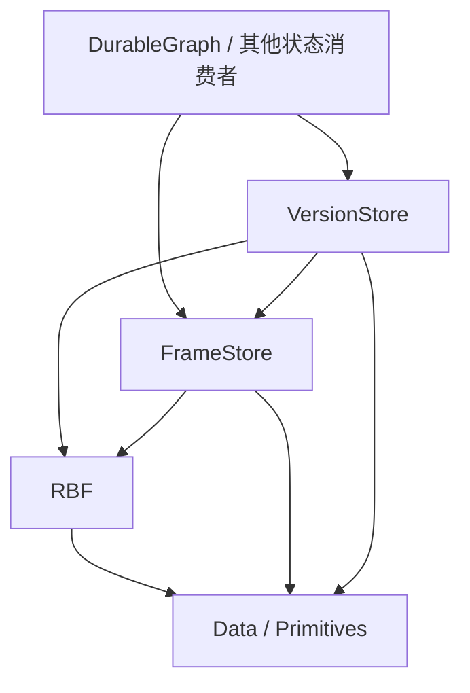

# S0：总体边界与决策

日期：2026-10-03；2026-10-04–05 确认 FrameStore 文件租借、目录与资源合同；2026-10-07 采用完整根地址字典、单文件 ref、活跃 Builder 期间的已完成输出资格，以及命名 fork 的目录共同发布；2026-10-08 确认 FrameAddress 固定 12B 编码；2026-10-09 明确 MVP 设计组合只包含核心存储与发布能力。状态：**会话方向已确认；S2–S6 剩余 wire/API 与工程选择仍为 Draft；参考依赖拆分 Accepted**。
本文件记录本次用户已表达的决策。规范写法依 [规范约定](../spec-conventions.md)。API/wire 的具体选择由后续阶段细化。

## term `FrameStore` 中性的 Frame 存储库

新项目 `Atelia.FrameStore` 管理带不透明地址的不可变 binary frames，对外提供三种单帧追加入口、提前地址、随机读取及同步耐久确认。文件选择、物理相邻关系和写入调度属于内部实现；普通分配合同不提供业务上的全局顺序。

## term `VersionStore` 根发布与命名版本控制库

新项目 `Atelia.VersionStore` 发布完整的 `string => FrameAddress` 字典快照。ref 是可更新的字典，tag 是命名不可变字典，branch 是名称到稳定 RefId 的绑定。应用自行解释每个 Key；一次快照可同时选择多个树或图的根，不要求独立 Commit 对象或通用 parent。

## term `Frame-Address` 中性帧地址

FrameStore 坐标系中定位一个 frame 的地址，候选代码名为 `FrameAddress`。它不内含 EventFrame、Parent、图节点或应用根的业务定义；解释时必须有明确的存储上下文。

## term `Publication` 发布

一次完整发布记录整体替换一个 ref 的根地址字典，或建立不可变 tag / branch 名称绑定。数据帧完成、依赖耐久、发布记录完成、调用方取得发布确认分别具有自己的资格。

## term `Root-Map` 完整根地址字典

候选代码名 RootMap，内容为 `string => FrameAddress`。字典按值保存，Key 唯一；空字典是合法快照，不等于对象不存在。所有地址解释于 VersionStore 绑定的一个 data FrameStore；应用状态、工具意图、随机状态、轨迹与业务谱系保存在其指向的数据中。

## 已确认决策

### decision [S-NEW-STORAGE-PROJECTS] 新能力由新项目承载

MUST 新建 FrameStore、VersionStore 两个生产项目及分别配套的单元测试项目。
新栈 MUST 不依赖 `Atelia.RbfSegmentStore` 或 `Atelia.EventJournal`。二者在 main 保留为冻结参考，维护和公开交付归 `RBF1` 分支；不得借本方案向旧库加入新职能或替换其存储实现。

2026-10-04 用户确认：main 的旧源码、测试和 toolkit 保留原目录，底层 Rbf/Data/Primitives 精确 PackageReference `[0.2.0-rbf1-preview.1]`，不跟随 main 底层源码、不新增运行时适配。当前 solution 保留新旧两组测试；主线 pack 仅 Primitives → Data → Rbf，两个旧库 IsPackable=false。实施与 assets/包验收见[参考代码过渡方案](../rbf1-reference-transition.md)，这不代表 FrameStore/VersionStore 已创建。

### decision [S-RBF-ATOMIC-FRAMES] 接受 RBF 帧原子模型

新栈 MUST 使用 RBF3 普通可写打开的物理恢复能力，以恢复后存在的完整事实帧构建状态。下游 MUST 不通过残缺尾帧推断业务过程或保留部分业务结果。
单帧原子性限于 [RBF 当前恢复模型](../Rbf/rbf-interface.md)；成功 EndAppend、DurableFlush 返回及发布成功不得合并为同一事件。

### decision [S-ROOT-PUBLISHED-LAST] 状态根最后发布

保存或替换 RootMap 的协议 MUST 先完成该 RootMap 所需的新增应用数据帧，再确认全部新增依赖耐久，随后追加单条完整字典记录、确认其耐久，最后安装内存状态。发布旧字典可以复用其既有数据帧。新 ref 的发现还须完成其目录发布步骤，不能把私有文件 flush 视为已经对外建立对象；命名 fork 在同一个目录发布点同时建立新 ref 与初始 branch。仅把 branch 名称绑定到既有 ref 不重新发布 RootMap，只确认绑定记录及其正式文件发布。
消费者 MUST 保证依赖闭包由此前已耐久帧和本次完成、确认耐久的新增帧组成。通用库不得声称可从任意 opaque payload 自动证明该闭包。

### decision [S-NEUTRAL-STATE-ROOTS] 状态根保持中性

RootMap MUST 用 @`Frame-Address` 表达中性根地址，不要求 EventFrame tag、EventFrameHeader、应用 Parent、graph schema 或业务 codec。VersionStore 不解释 Key 的业务角色，也不调用消费者业务回调来定义发布事实。

### decision [S-FS-OPAQUE-ALLOCATION] 分配与读取不依赖物理布局

2026-10-04 用户确认本轮分析与修订方向：FrameStore MUST 对普通调用方隐藏文件选择及物理地址关系；业务引用 MUST 通过地址表达，不得用地址大小、相邻关系或分配先后推断业务关系。
不透明地址本身不建立构建自由；本轮另通过下面的文件租借决策明确多个活跃 Builder 和交错完成。它仍不承诺 free/GC、帧搬迁或首版多线程使用。

### decision [S-FS-THREE-APPEND-MODES] 保留 RBF 的三种单帧追加方式

2026-10-04 用户确认：FrameStore MUST 提供带数据 buffer 的 Append、未知尺寸 BeginAppend，以及分立 payloadLength/tailMetaLength 的已知尺寸 BeginAppend。已知尺寸入口提前签发 FrameAddress，未知尺寸入口在完成时返回地址。
本层只提升寻址与 owned 生命周期，不复制 RBF layout/CRC/EscapeKey 或 payload/meta 编码规则。确切 wrapper、读结果及错误签名在 S2 定稿。

### decision [S-FS-ADDRESS-FIXED12] 基础地址固定编码为 12B

2026-10-08 用户确认：**FrameAddress 首版固定编码为 12B，保持完整 uint FileId 与 SizedPtr；额外见证按明确需求引入，不把未来预留或内容 CRC 纳入基础定位合同。** 文件编号非零、不回绕，SizedPtr 的现有偏移与长度容量保持；已知尺寸 Begin 签发的完整地址在正常 End 后不改变。
本决策锁定基础持久编码，不锁定 CLR struct 的内存尺寸或参数传递 ABI。StoreId 继续由上下文及上层持久绑定承载；地址不证明原始来源、完成、耐久或追加尝试身份。store fingerprint、generation 与内容见证若出现明确需求，单独定义保证及编码演化，不为它们在首版地址中预留字段。S2 `[F-FS-FRAME-ADDRESS-12B]` 细化唯一 codec，后序 RootMap 与互引消费该格式。

### decision [S-FS-CORE-INDEPENDENT] MVP 仅组合核心存储与发布能力

MVP MUST 仅组合 RBF3、FrameStore 核心与 VersionStore 的发布、历史和命名能力。S2 只定义不透明分配、随机读取、文件生命周期与同步耐久确认；VersionStore 直接使用自己的 RBF3 文件持久化 ref、tag 和名称记录。扩展能力的需求、合同与实施单独审定，不成为核心的格式、API、实施片或 Accepted 出口要求。
VersionStore MUST NOT 依赖具体应用构建 State 中间帧的申请顺序、完成顺序或物理排列来定义发布事实；首版发布依据自己的单文件 ref 和命名记录。

### decision [S-FS-FILE-LEASES] 文件租借串行且可嵌套

FrameStore MUST 以单文件独占租借支持多个尚未完成的 Builder；每个 RBF 文件仍最多一个活跃 Builder。再次申请时使用其他可分配文件，不能隐式结束已有 Builder。活跃 Builder 可以交错填充，并按不同于申请次序的顺序完成。
文件选择、租借、归还与维护 MUST 串行；首版公共合同仍只承诺调用方串行使用。实现保留每个 Builder 的文件与构建资源独立，使将来不同 Builder 各由一个线程使用成为可单独验收的扩展；本轮不宣称已提供并行、屏障竞争或并发 fault 资格。

### decision [S-FS-COMPLETED-OUTPUT-INDEPENDENT] 活跃构建不阻断已完成输出的使用

2026-10-07 用户确认：ConfirmDurable MUST 确认调用时已经完成的全部必要输出；未完成 Builder 保持原状，不因此获得完成或耐久资格。MUST NOT 仅因无关 Builder 尚未归还而拒绝已满足依赖闭包要求的 RootMap 发布；应用仍负责本次根所需的新增依赖全部完成，VersionStore 仍按数据先确认、根后发布执行。
Builder 活跃期间 MUST 允许随机读取该文件已完成前缀内的历史帧；正在构建的新帧仍不可读。文件独占租借约束新增帧的构建资格，不对此前完整帧施加额外读取禁令。随机读取消费 RBF 的 completed-prefix 合同，生命周期、共享 fault、完整内容校验及串行调用保持不变；本轮不扩大扫描、扫描边界或物理后继查询资格。

### decision [S-FS-LOWEST-ACTIVE-FIRST] 优先租借可分配的最低编号文件

2026-10-04 用户提出并确认采用简单确定规则：普通 FrameStore MUST 从 active 集合内当前可分配文件中选择数值 FileId 最小者。已租出或停止分配的文件不参与选择，不等待低编号文件归还；没有可分配文件且通过准入检查时才创建新文件。
三种追加入口共用此规则，不引入按已知帧尺寸试配、负载均衡或轮询。本条不建立帧的业务顺序。

### decision [S-FS-SOFT-ROTATION] 三种追加统一采用事后软轮转

FrameStore MUST 在成功完成帧后按文件 TailOffset 检查轮转，只有大于阈值才停止该文件的新追加；等于阈值仍可追加。不依据已知帧尺寸提前轮转，也不因本次追加超过目标阈值拒绝合法 RBF 帧。
阈值是轮转触发值，不是单文件最大尺寸；RBF/Data 的单帧和起始偏移硬限制仍有效。阈值范围、默认及重开处理由 S2 细化。

### decision [S-FS-DIRECTORY-LIFECYCLE] 目录表达可写与归档状态

可写文件集合 MUST 由 active 目录中的规范文件表达；成功归档文件进入按编号固定分桶的 archive 目录，后续只读。无需另存 active manifest/status 或全历史分段表。
新文件在私有创建槽位完成初始化后才发布到 active、签发地址；归档必须先停止分配、flush、关闭 writer，再同文件系统 rename，禁止覆盖既有目标。保留 create-only 格式门与整个 store 的独占可写 owner；确切编码、平台入口、编号恢复及中断裁决在 S2 定稿。
首版采用固定 1024 编号一个归档桶的布局方向，S2 定义计算关系；桶大小不作为可随实例更改的设置。

### decision [F-FS-HEADER-FIRST] 首帧承载 FrameStore 文件元信息

2026-10-05 用户确认采用首帧 meta/header：每个新 RBF3 文件 MUST 在首个 frame 中写 FrameStore 自有文件元信息，至少保留版本解释能力，再开始用户帧追加。该帧在私有创建阶段完成后才向 active 发布。
字段、codec、tag、初始化/读取校验顺序及扫描展示规则由 Coding Agent 研究定稿，不再把“是否采用 header”作为需求阻断。优先评估最小版本与 StoreId/FileId 绑定，不增加业务 schema、发布关系或可变状态。

### decision [S-FS-END-RETURNS-LEASE] 成功 EndAppend 自动归还文件

2026-10-05 用户确认：EndAppend 正常成功返回前 MUST 结束该 Builder 的租借并自动归还文件，调用方不需要再 Dispose 才能释放租借或数量配额。后续 Dispose/旧副本不二次归还；可纠正提交拒绝仍保留租借。
归还不撤销已完成帧，也不单独证明耐久。超阈值文件立即停止新分配；归档维护放在哪个受控入口、维护失败如何报告，仍由 S2 工程定稿。

### decision [S-FS-LIMIT-FROM-CONFIG] 配置文件控制未归还 Builder 上限

2026-10-05 用户确认：首版 MUST 通过 config 文件提供可调整的未归还 Builder 数量上限，达到上限时新 Builder 申请立即拒绝，不等待、不抢占、不因为确定拒绝而 fault。不能把数量上限仅写成编译期固定常量。
首版只以此数量控制 Builder 准入，不增加精确总内存或总文件句柄的第二套配额账本；这不承诺资源占用硬上限。config 的位置/格式、默认、缺失/非法值和生效规则由 Coding Agent 定稿；config 是运行策略，不承担 active 集合、下一编号、文件格式身份或业务事实。

### decision [S-VS-ROOT-MAP-SNAPSHOTS] 完整字典直接发布

2026-10-06–07 用户提出并经两类下游场景评估：每个 ref / tag 的内容 MUST 是完整 RootMap，一次替换全部 Key；branch 只绑定 RefId。发布和选择不经过独立 Commit/Parent，也不默认增加全局控制日志、Prepare token、精确尝试查询、通用 CAS 或派生 checkpoint。
tag 创建后不改；ref rewind 追加旧字典的新快照，不能截掉已有完整历史。fork 用旧字典创建独立 ref，复用不可变数据地址。业务因果链、外部 operationId、模拟器 RNG 与进度由应用数据表达；这些信息不成为 VersionStore 自有字段。

### decision [S-VS-REF-SINGLE-FILE] 首版 ref 使用单个 RBF3 文件

2026-10-07 用户明确要求：每个 ref MUST 使用一个以稳定唯一 RefId 定位的 RBF3 文件，每次更新追加一个完整字典帧；当前值只读最后快照。首版不分段、不轮转、不差分。RBF / SizedPtr 的帧尺寸和起始偏移硬界仍有效，超界显式拒绝，不能覆盖、回绕或截掉旧历史。
历史选点是首版功能：从固定已完成上界逆序枚举完整快照，返回枚举结束后仍可使用的自有字典。随机历史读取、持久 cursor、索引及文件分段可以作为后续局部实施片；不提前写入其 wire。

### decision [S-VS-NAMED-FORK-ATOMIC] 命名 fork 共同发布新 ref 与 branch

2026-10-07 用户接受：**命名 fork 成功发布时，新 ref 与 branch 一起可见；发布前，普通查询两者都不可见。失败可以留下私有准备文件，但不会留下公开的未绑定 ref。**
组合创建入口 MUST 在同一个私有 RefId 目录内准备完整 ref 与初始 branch 绑定，各文件 flush/close 后，以同文件系统、不覆盖的一次目录 rename 共同发布。所有 ref 采用统一的 RefId 容器目录；所有 branch 绑定（包括后加的 alias）放在所属 ref 的 `names` 子目录，不另设初生绑定表示、正式 Creating 名称或永久 branch 发布 gate。
普通 CreateRef 仍可建立未命名 ref；CreateBranch(name, refId) 仍只命名既有 ref。调用方手工组合这两个公开操作不是事务，新组合入口不得以先公开 CreateRef 再补绑定实现。名称查找与查重覆盖全部正式 ref 的名称集合；单 writer/driver 串行准入保证检查至提交期间无其他名称创建交错，不能将局部 no-overwrite 误称为跨目录全局名称锁。
（Informative）该选择用冷名称发现的目录扫描成本换取较少持久状态；允许可重建内存名称表，但不增加持久 catalog、通用事务或精确尝试账本。目录 rename 的平台资格仍须实施验收；逻辑原子不保证磁盘上没有私有残留，也不消除 Unknown。

### decision [S-LEGACY-READ-ONLY] 主线旧格式只读且无转写

主线 RBF 的 RBF1 MUST 保留底层只读兼容；新栈写入 MUST 使用纯 RBF3 新文件。新栈不向旧库追加、不在一个库内建立 RBF1/RBF3 混合续写、不进行 RBF1 → RBF3 转写或旧地址迁移。本条不限制 RBF1 维护线及其固定包按原合同写入旧栈。
旧消费者继续按各自固定版本及原支持范围运行。RBF 可读兼容不等于 FrameStore 能直接打开旧 EventJournal/SegmentStore 目录；新栈有自己的格式身份。

### decision [S-STAGES-FLOW-FORWARD] 阶段依赖单向

后续阶段 MUST 消费前序阶段已明确的合同；前序层的运行时正确性不得依赖后序层存在。下游发现下层缺口时，修改下层合同并复验受影响阶段，不在下游复制实现知识。

### decision [S-RBF-SIZED-APPEND-SPLIT-LENGTHS] 已知尺寸追加分别声明 payload 和 meta 长度

2026-10-04 用户确认：新 RBF `out ticket` 入口 MUST 接收分立的 payloadLength、tailMetaLength，与 MeasureWriteSize 的输入一致。
Begin 固定两部分逻辑长度，正常 EndAppend(tag) 使用声明的 meta 长度；保持现有紧密存储和一个 PayloadAndMeta writer。本决策不要求分别对齐或改变 wire-format。
具体签名、可纠正拒绝和取消后的 ticket 资格见已定稿的 [S1](01-rbf-sized-append.md)。S2/S3 规划和执行均保留这两个输入，不只保留求和结果。

## 推荐职责与依赖（候选）

箭头表示 C# 项目依赖；Primitives/Data 的直接引用按实际使用决定。新生产库不得引用 atelia 业务项目、其 Analyzer 或旧存储库。旧栈依赖闭包保持独立。

| 事实或资格 | 唯一负责层 | 其他层的使用方式 |
| --- | --- | --- |
| RBF profile、padding、长度、CRC、尾部恢复 | RBF | 调用公共 API，消费恢复结果 |
| store 身份、文件定位、FrameAddress、完成资格 | FrameStore | 用不透明地址及生命周期合同访问 |
| 调用时本 owner 的全部必要完成输出已耐久 | FrameStore | 同步 barrier 返回后才尝试发布；活跃 Builder 不被确认，不能推导业务闭包 |
| 某根是否构成合法状态、全部引用是否已覆盖 | 消费者中层 | 构建完成后选择根并准备发布 |
| RootMap codec、ref 当前值与发布历史、branch/tag 绑定 | VersionStore | 查询完整快照，发布多个根，不比较 data 地址大小 |
| 应用因果链、fork origin、工具进度和模拟器完整状态 | 消费者中层 | 放入 opaque 数据帧，不把 ref 历史当作业务谱系 |
| FrameStore 目录生命周期；上层 snapshot、查询索引与缓存 | 其所属存储层 | 目录按本层协议解释；派生投影不能制造新的业务发布 |
| 完整历史/图语义健康 | 显式 audit / 消费者 validator | 不由普通 Open 成功代替 |

### 当前模型：单文件 ref 与完整字典发布

FrameStore 核心为多个 active 文件的独占租借与目录归档，不提供业务全局顺序。

VersionStore 借入一个 data FrameStore，拥有独立的 RBF3 发布目录；格式门绑定两者身份。每个 ref 的 RefId 容器目录内保留一个同 RefId 命名的追加文件及 `names` 子目录；tag 按稳定名称哈希分桶，首版每桶一个追加文件；branch 使用 create-only 的名字到 RefId 绑定。具体 codec / 路径编码按 S4/S5 工程定稿，旧参考库不进入依赖。

完整字典使当前值无需 replay 历史，回溯时才枚举该 ref。字典内容从完整 checked-read 得到，拥有独立生命周期；选择旧快照后可新建 ref、创建 tag 或追加 rewind。匿名 fork 用 CreateRef，命名 fork 用组合入口随目录一次发布 ref 与初始绑定；给既有 ref 加 alias 只发布一个名称文件。S4 的 ref 读写不解释 S5 名称记录，也不因名称损坏改变 ref 的身份或当前字典。

RefId 是稳定对象身份；RefRevision 只表示已完成快照的位置，不提前签发，不用作 Unknown 尝试 token。历史枚举期间首版禁止 owner mutation。跨重开的应用书签可使用 tag，无需先提供随机 revision 读取或持久扫描 cursor。

CreateRef / PublishRef / CreateTag 及命名 fork 在发布 RootMap 前同步调用 data ConfirmDurable，不向调用方传递可复用 `DurabilityReceipt`；无关 Builder 未完成不阻断该屏障或发布，所需依赖仍须由应用保证完成。CreateBranch 不新增 data 屏障。branch 冷发现覆盖全部正式 ref 的 names，tag 查找与重名检查覆盖目标桶；均可使用可重建内存投影，不保证首次查询 O(1)。字典、桶和文件容量按实际 codec 与公共尺寸 API 计算，“约 64B”只是少根短键场景估算。

VersionStore 内部投影安装与消费者安装应用状态分别负责。发布已确认后前者失败仍保留 Confirmed 并停用库实例；应用安装失败时，从实际已发布字典重新加载，不撤销发布、不要求业务 callback。外部工具 exactly-once 和模拟确定性不是存储层保证。

2026-10-03 的设计审阅与 2026-10-04 Commit/control 草案保留历史身份；当前需求适配判断见[两类下游评估](reviews/2026-10-07-downstream-fit.md)，它是源码与失败轨迹评估，不是新库实现验收。

## 故障模型与建议范围

首版为单 driver 串行操作、可嵌套文件租借、append-only、显式只读打开、进程终止及部分写入模型。多个活跃 Builder 不等于多线程并行；未来并行扩展保留独立边界。只读入口继承 RBF 的只验证、不修尾行为；可写入口接受 active 中每个文件的物理恢复。使用读写模式不能改变内容损坏的判定。

IO/发布尝试后结果可能 Unknown；完整记录可在重开后存在。首版重开读取实际 ref/tag/name 状态，不依据原异常假设失败，也不盲重试；当前值相同不证明某次调用曾得到 Confirmed。已知损坏不能通过回退到更早根来掩盖。

同文件多 writer、多线程执行、跨实例实时 CAS、在线外部改写、GC/compaction、跨库事务及更强的断电模型属于单独需求；首版覆盖一个 RootMap 的原子发布，不建立跨 ref 全序或原子事务。

## 旧库维护边界

当前 [根 README](../../README.md) 区分 main RBF3 新栈、main 冻结参考和已公开 RBF1 系列。[历史调查](../Rbf/rbf3-adaptation-baseline-investigation.md)记录旧源码直接跟随 RBF3 的编译/语义断点，不作为本轮依赖拆分测试结果。

旧栈维护首先选定 RBF1 分支中受支持的具体源码/包基线，再修复该基线的问题；main 仅保留冻结参考及独立回归。不把新栈自动恢复、批次或版本协议写回旧库，也不通过 `out _` 或其他运行时适配把旧 strict 打开改成 RBF3 恢复打开。

本轮按[过渡方案](../rbf1-reference-transition.md)冻结底层三个公开包，已 Accepted。Release solution build、完整 solution `--no-build` 1525/1525、每组实际 assets 及 W: 三包候选消费均已核对，来源见[验收记录](../rbf1-reference-transition.md#6-验收记录)；没有删除旧项目或跳过测试。旧库继续保留但 IsPackable=false。本轮不切换消费应用、不迁移磁盘数据。

## 当前已证实与未证实

| 事项 | 证据状态 |
| --- | --- |
| RBF3 create/open/recovery 及串行、资源异常边界 | 当前 [接口规范](../Rbf/rbf-interface.md)和 [70d1009 随附验收](../Rbf/rbf3-review-repairs-acceptance.md)；本次未重跑 |
| 精确尺寸公共 API、提前 ticket Builder、格式投影 | [S1](01-rbf-sized-append.md) 已 Accepted；实现 `8ab98bf`、RBF 818/818 与 W: public 源码消费等身份见[阶段验收](01-rbf-sized-append-acceptance.md) |
| main 参考依赖拆分及三包交付入口 | [过渡验收](../rbf1-reference-transition.md#6-验收记录) Accepted；1525/1525、七个旧栈 assets 图及 `4db3b8f` 的 W: 三包候选消费通过，不重标 S1 历史结果 |
| 新 FrameStore / VersionStore 与其测试项目 | 尚未创建 |
| 新根发布模型 | 本次需求与候选设计，尚无实现证据 |
| DurableGraph 当前接口及接入 | 2026-10-04 已定位兄弟仓；生产代码仍使用未知尺寸 Begin/End，无新 API 接入证据，不以历史 tag 文档代替实证 |

## S0 出口

会话已确认新项目、旧库维护边界、RBF 恢复方向、不透明分配、三种追加方式、嵌套文件租借、统一软轮转、目录生命周期、首帧 meta/header、成功 EndAppend 自动归还、数量上限配置文件，以及完整根字典最后发布、单文件 ref、历史选点与命名 fork 的目录共同发布。活跃 Builder 不再阻断对已完成输出的确认、随机读取或独立闭包的根发布。header/config、codec/路径编码/API 和恢复细节仍须工程定稿。
S1 的单文件尺寸和 ticket 合同已实施并独立验收为 Accepted。S2–S6 仍是 Draft，具体 wire、类名、方法签名及性能预算按各阶段阻断项细化；本片不代表新库或下游适配已完成。
