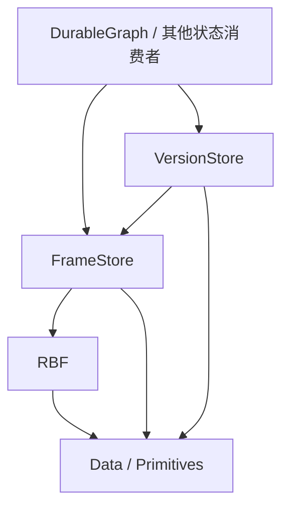

# S0：总体边界与决策

日期：2026-10-03；2026-10-04 补充 S1 分立长度决策。状态：**会话方向已确认；建议项仍可迭代**。
本文件记录本次用户已表达的决策。规范写法依 [规范约定](../spec-conventions.md)。API/wire 的具体选择由后续阶段细化。

## term `FrameStore` 中性的 Frame 存储库

新项目 `Atelia.FrameStore` 管理带中性地址的不可变 binary frames，承接文件组织、追加、读取、批次地址规划及同步耐久确认。每个实例管理一个追加流；不同实例复用同一合同。

## term `VersionStore` 根发布与命名版本控制库

新项目 `Atelia.VersionStore` 在 FrameStore 上发布状态根，提供 ref、branch、tag 与发布历史。状态的构建、解释与业务合法性属于消费者。

## term `Frame-Address` 中性帧地址

FrameStore 坐标系中定位一个 frame 的地址，候选代码名为 `FrameAddress`。它不内含 EventFrame、Parent、图节点或应用根的业务定义；解释时必须有明确的存储上下文。

## term `Publication` 发布

消费者构建的状态根经完整发布记录成为某个发布对象的可见版本。物理 frame 已存在、写入已耐久及状态已发布分别具有自己的资格。

## 已确认决策

### decision [S-NEW-STORAGE-PROJECTS] 新能力由新项目承载

MUST 新建 FrameStore、VersionStore 两个生产项目及分别配套的单元测试项目。
新栈 MUST 不依赖 `Atelia.RbfSegmentStore` 或 `Atelia.EventJournal`。二者进入维护和修复范围，继续服务旧消费者及其数据；不得借本方案向旧库加入新职能或替换其存储实现。

### decision [S-RBF-ATOMIC-FRAMES] 接受 RBF 帧原子模型

新栈 MUST 使用 RBF3 普通可写打开的物理恢复能力，以恢复后存在的完整事实帧构建状态。下游 MUST 不通过残缺尾帧推断业务过程或保留部分业务结果。
单帧原子性限于 [RBF 当前恢复模型](../Rbf/rbf-interface.md)；成功 EndAppend、DurableFlush 返回及发布成功不得合并为同一事件。

### decision [S-ROOT-PUBLISHED-LAST] 状态根最后发布

协议顺序 MUST 为：规划新帧地址 → 完成状态构建 → 确认全部新增依赖耐久 → 追加根发布记录 → 确认发布记录耐久 → 安装内存状态。
消费者 MUST 保证依赖闭包由此前已耐久帧和本次完成、确认耐久的新增帧组成。通用库不得声称可从任意 opaque payload 自动证明该闭包。

### decision [S-NEUTRAL-FRAME-TARGETS] 根目标使用中性地址

VersionStore MUST 以 @`Frame-Address` 表达目标；不得要求 EventFrame tag、EventFrameHeader、Parent、graph schema 或应用 codec。VersionStore 不调用消费者业务回调来定义持久事实是否已发布。

### decision [S-LEGACY-READ-ONLY] 旧格式只读且无转写

RBF1 MUST 保留底层可读兼容；新写入 MUST 使用纯 RBF3 新文件。新栈不向旧库追加、不在一个库内建立 RBF1/RBF3 混合续写、不进行 RBF1 → RBF3 转写或旧地址迁移。
旧消费者继续按各自固定版本及原支持范围运行。RBF 可读兼容不等于 FrameStore 能直接打开旧 EventJournal/SegmentStore 目录；新栈有自己的格式身份。

### decision [S-STAGES-FLOW-FORWARD] 阶段依赖单向

后续阶段 MUST 消费前序阶段已明确的合同；前序层的运行时正确性不得依赖后序层存在。下游发现下层缺口时，修改下层合同并复验受影响阶段，不在下游复制实现知识。

### decision [S-RBF-SIZED-APPEND-SPLIT-LENGTHS] 已知尺寸追加分别声明 payload 和 meta 长度

2026-10-04 用户确认：新 RBF `out ticket` 入口 MUST 接收分立的 payloadLength、tailMetaLength，与 MeasureWriteSize 的输入一致。
Begin 固定两部分逻辑长度，正常 EndAppend(tag) 使用声明的 meta 长度；保持现有紧密存储和一个 PayloadAndMeta writer。本决策不要求分别对齐或改变 wire-format。
具体签名、可纠正拒绝和取消后的 ticket 资格见已定稿的 [S1](01-rbf-sized-append.md)。S2/S3 规划和执行均保留这两个输入，不只保留求和结果。

## 推荐职责与依赖（候选）

箭头表示 C# 项目依赖；Primitives/Data 的直接引用按实际使用决定。新生产库不得引用 atelia 业务项目、其 Analyzer 或旧存储库。旧栈依赖闭包保持独立。

| 事实或资格 | 唯一负责层 | 其他层的使用方式 |
| --- | --- | --- |
| RBF profile、padding、长度、CRC、尾部恢复 | RBF | 调用公共 API，消费恢复结果 |
| store 身份、segment 定位、FrameAddress、完成前缀 | FrameStore | 用地址及生命周期合同访问 |
| 本 owner 的全部完成输出已耐久 | FrameStore | 同步 barrier 返回后才尝试发布，不能推导业务闭包 |
| 某根是否构成合法状态、全部引用是否已覆盖 | 消费者中层 | 构建完成后选择根并准备发布 |
| 根发布、ref 身份与版本、branch/tag 绑定 | VersionStore | 消费者查询或变更当前版本 |
| locator、snapshot、查询索引、缓存 | 其所属存储层 | 从事实重建，不能制造新的业务发布 |
| 完整历史/图语义健康 | 显式 audit / 消费者 validator | 不由普通 Open 成功代替 |

### 本轮审阅选择的最小模型（候选，非新增用户决策）

FrameStore 保持单流。VersionStore **借入一个 data FrameStore，拥有一个私有 control FrameStore**；根地址只在 data 上下文解释，发布记录定位只在 control 上下文解释。二者使用同一个 FrameAddress 类型，不增加通用多流平台或第三个生产项目。

根的全部新增依赖属于借入的 data owner。发布 Commit 内同步确认其全部完成前缀，然后追加、确认控制记录；不向调用方传递可复用 `DurabilityReceipt`。消费者继续保证 opaque 引用闭包。

稳定 ref、CAS revision 和发布尝试共用一种控制记录 token 的表示。Prepare 在业务输出前把 token 交给调用方；实际发布是一条控制记录。名称核心先完成，复杂索引与完整工具产品不作为第一次根发布的前置。

控制流分离解决任意 data suffix 干扰控制回放的问题，**不等于已取得有界打开资格**。第一片允许完整控制回放；snapshot 的规模合同另行审定。采用双上下文是本轮技术候选，不把单帧原子性扩大成两个 store 的原子事务。

VersionStore 内部 ref/name 投影安装与消费者安装应用状态分别负责。发布耐久后前者失败仍保留 Confirmed 并停用库实例；Publish 返回后应用安装失败，由应用停用旧状态并重新加载已发布根，不撤销发布、不要求业务 callback。

## 故障模型与建议范围

建议首版为单 driver 串行操作、append-only、显式只读打开、进程终止及部分写入模型。只读入口继承 RBF 的只验证、不修尾行为；可写入口接受物理恢复。使用读写模式不能改变内容损坏的判定。

IO/发布尝试后结果可能 Unknown；完整记录可在重开后存在。新栈保留查询结果所需的稳定身份，不依据原异常假设失败，也不盲重试。已知损坏不能通过回退到更早根来掩盖。

多 writer、跨实例实时 CAS、在线外部改写、GC/compaction、跨库事务及更强的断电模型属于单独需求；本轮阶段草案先覆盖同一存储上下文中的完整事实和有序发布。

## 旧库维护边界

当前 [根 README](../../README.md) 同时说明了已发布包及未发布 v2；两者合同不同。[调查](../Rbf/rbf3-adaptation-baseline-investigation.md)记录旧源码在 RBF3 下的编译/语义断点。
维护任务首先选定受支持的具体源码/包基线，然后修复该基线的问题。不能把新栈的自动恢复、批次或版本协议写回旧库；也不能只加 `out _` 就声称旧 strict 合同得到保留。

新栈定点 build/test 可以独立推进。最终 solution/pack 资格仍需如实记录旧库问题，必要维护在独立工作包中处理；不能删除旧项目来制造全绿结果。本次文档不选择旧库的新依赖版本，也不切换旧实例。

## 当前已证实与未证实

| 事项 | 证据状态 |
| --- | --- |
| RBF3 create/open/recovery 及串行、资源异常边界 | 当前 [接口规范](../Rbf/rbf-interface.md)和 [70d1009 随附验收](../Rbf/rbf3-review-repairs-acceptance.md)；本次未重跑 |
| 精确尺寸公共 API、提前 ticket Builder、格式投影 | [S1](01-rbf-sized-append.md) 已 Accepted；实现 `8ab98bf`、RBF 818/818 与 W: public 源码消费等身份见[阶段验收](01-rbf-sized-append-acceptance.md) |
| 新 FrameStore / VersionStore 与其测试项目 | 尚未创建 |
| 新根发布模型 | 本次需求与候选设计，尚无实现证据 |
| DurableGraph 当前接口及接入 | 2026-10-04 已定位兄弟仓；生产代码仍使用未知尺寸 Begin/End，无新 API 接入证据，不以历史 tag 文档代替实证 |

## S0 出口

会话已确认新项目、旧库维护边界、RBF 恢复方向、中性地址及根最后发布。
S1 的单文件尺寸和 ticket 合同已实施并独立验收为 Accepted。S2–S6 仍是 Draft，具体 wire、类名、方法签名及性能预算按各阶段阻断项细化；本片不代表新库或下游适配已完成。
