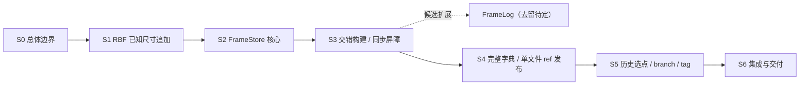

# FrameStore / VersionStore 分阶段设计入口

日期：2026-10-03；2026-10-05 确认 FrameStore header、归还、config 与核心/扩展分离；2026-10-07 更新完整字典和单文件 ref。状态：**S1 Accepted；S2–S6 Draft，FrameLog 为独立候选且不是首版依赖，两个新项目尚未创建；参考依赖拆分 Accepted**。
初始设计源码观察基线：`main @ 70d1009e78a73342a0c0fdc8ffed7731dec58173`；S1 验收记录的核对基线为 `f6f1eb38557863ba5ea1634844a90f0cbe5774cf`；前轮设计阅读基线为 `4175a46`，本轮租借/目录修订核对 `50e8e28`。本文档集供逐阶段细化、审阅和实施，不把文档修订视为新实现或验收。

目标：**以 RBF3 的帧原子性为基础，让中层构建新状态，再发布完整根地址字典使状态生效。**
恢复依据是完整事实帧及其有效发布记录。RBF 处理物理尾部；FrameStore 分配不可变帧并按地址读取；中层负责状态构建和业务依赖闭包；VersionStore 管理字典快照、ref 历史与 branch/tag。

main 当前演进主线为 RBF3 / FrameStore / VersionStore。旧 EventJournal/RbfSegmentStore、toolkit 及测试保留为冻结参考，底层精确 PackageReference `[0.2.0-rbf1-preview.1]`；维护和公开交付归 RBF1 分支。依赖隔离、solution 共存与本轮仅三包交付的实施及证据见[过渡方案](../rbf1-reference-transition.md)。本轮不删除旧目录、不创建新项目，也不改变 main 的 RBF1 只读兼容。

## 当前最小模型

FrameStore 普通合同是不透明地址分配与随机读取，不提供业务全局顺序。保留 RBF 三种追加方式；每个 Builder 独占一个文件，owner 可以嵌套租借多个文件、交错构建并乱序完成，首版调用仍串行。三种追加统一在成功完成后按 TailOffset 大于软阈值触发轮转。
文件分配优先选择 active 中当前可分配的数值最低 FileId；忙文件和已停止分配文件跳过，没有候选才新建。不因已知帧尺寸提前试配，也不引入轮询或负载均衡。
私有 creating 槽位完成必需首帧 meta/header 后发布到 active；header 至少提供版本解释，字段/codec 由 Coding Agent 定稿。active 目录表达可写集合，flush/close 后移入固定 1024 编号分桶的 archive 并只读，不维护 active manifest 或全历史分段表。屏障确认全部必要 active 输出。
成功 EndAppend 自动归还文件和数量配额，不等后续 Dispose。config 文件提供可调整的未归还 Builder 上限，超限立即拒绝，不引入精确总内存账本；config 格式/默认/生效、编号恢复和归档维护的确切协议仍须工程定稿。
循环引用可以直接通过多个已知尺寸 Builder 的提前地址形成，不以完整 FrameBatch/BeginNext 为首版前置。FrameStore core 与交错构建/耐久确认可以独立定稿、实施和验收。
[FrameLog](extensions/framelog-candidate.md) 已从 S2 迁为独立可选扩展候选；术语、顺序/cursor 合同、工程问题与验收要求均在该文档。去留与实施范围尚未确认，不阻断核心出口。
2026-10-07 VersionStore 收缩为完整 `RootMap = string => FrameAddress` 快照：每个 ref 一个 RBF3 文件，每次更新追加完整字典；tag 保存命名不可变字典，按固定名称哈希分桶；branch 为 name → 稳定 RefId 的 create-only 绑定。首版不分段/轮转 ref，不引入差分、checkpoint、独立 Commit/Parent 或全局 FrameLog。
VersionStore 借入一个 data FrameStore，拥有自己的 RBF3 发布目录。CreateRef / PublishRef / CreateTag 先完成应用数据，再同步 data ConfirmDurable，随后追加/确认字典发布记录并安装内存投影；应用收到成功确认后按字典加载状态。CreateBranch 只命名既有 ref、确认自己的绑定记录，不重新发布 RootMap 或调用 data 屏障。新建文件和名称还需完成正式目录发布。所有 Key 的业务语义由应用解释，不消费中间帧的构建顺序。
当前值完整读取最后快照；历史从固定完成上界逆序枚举，返回结束枚举后仍可使用的自有字典。fork 复制旧字典到新 ref，rewind 追加旧字典成为新 revision，tag 冻结所选字典。RefRevision 来自完整发布/实际历史枚举，不是输出前尝试 token。跨重开书签可用 tag。
输出异常停止实例并重开读取实际状态；完整快照损坏报错，不回退旧值。首版不提供通用 CAS 或精确 Unknown 尝试查询。数据闭包、工具 operationId、模拟器 RNG 和应用谱系由应用负责；[两类下游评估](reviews/2026-10-07-downstream-fit.md)未发现必须扩大核心的需求。

2026-10-03 的初始裁决及失败轨迹见[历史设计审阅](reviews/2026-10-03-dialectical-review.md)；旧单流、单 active/locator、纯 batch planner，以及后来 Commit/control 草案均已被后续会话修订，不作为当前模型的实现证据。S1 已 Accepted；已确认方向见 S0，S2–S6 的剩余工程选择仍是 Draft。

## 顺序与职责

| 顺序 | 权威合同 | 对外用途 |
| --- | --- | --- |
| 单个 RBF 文件的物理追加顺序 | RBF；S2 后端调度 | 原子帧恢复，不解释数据谱系 |
| 同一 ref 的快照追加顺序 | S4 单文件；S5 checked 历史枚举 | 选择当前值或旧快照；不建立跨 ref 全序 |
| 应用因果/实验谱系 | 应用数据 codec | 显式引用轨迹/来源，不由 ref 历史或 data 地址推算 |
| branch/tag 的名称唯一性 | S5 名称政策与持久记录 | 定位对象/不可变字典，不要求不同名称具有全序 |

下一轮重点讨论见[设计难题汇总](design-questions.md)。该文是问题索引与推导说明，不是额外阶段或前序层的规范输入；正式合同仍在相应 S0–S6。

## 阅读与状态规则

- 先读仓库根 [README](../../README.md)，再读 [S0 总体决策](00-architecture-decisions.md)。
- 本目录遵循 [规范约定](../spec-conventions.md)：`decision` 记录会话已确认方向；S1 的 `spec` 与签名已成为实施合同，S2–S6 仍是候选要求；未审定阶段的建议、算例、API 名称不自动冻结。
- 阶段状态使用 `Draft → Ready → Implementing → Accepted`。Ready 前定稿字段/API/算法及验收映射；可以对范围明确的必要子合同单独审定，未支持能力不得借整体标签宣称成立。
- S1 的实施合同提交为 `c940ed6`，实现提交为 `8ab98bf`；RBF 818/818、Data 288/288 和 W: public 源码消费已验收，实际工作树和二进制身份见[阶段验收记录](01-rbf-sized-append-acceptance.md)。本片不宣称新增包消费、性能或进程实杀通过，也不宣称下游已接入。
- 后续参考依赖拆分轮次已取得 RBF3 三包候选的 W: 隔离 PackageReference 消费资格；候选版本、实现提交和 76 个源码 checksum 见[过渡验收记录](../rbf1-reference-transition.md#6-验收记录)。它不重标 S1 的历史工件，也不代表公开发布或 FrameStore/VersionStore 已交付。
- 旧库维护归 RBF1 分支，main 仅保留冻结参考，不要求它们适配新栈。[原调查](../Rbf/rbf3-adaptation-baseline-investigation.md)基于 `e6ad4d2`，记录旧源码跟随新底座时的断点，不冒充本轮冻结依赖后的测试结果。

## 阶段顺序

下图的箭头表示合同依赖；下游使用的必要子合同必须先形成、实施并取得对应资格。它不要求整层横向完工后才能试验下一层；各阶段规范只依赖前序阶段。

| 阶段文档 | 本阶段形成的合同 | 主要实施范围 | 出口 |
| --- | --- | --- | --- |
| [S0 总体边界与决策](00-architecture-decisions.md) | 项目边界、事实归属、恢复模型、兼容政策 | 文档决策 | 后续阶段无需反向依赖消费者语义 |
| [S1 RBF 已知尺寸追加（Accepted）](01-rbf-sized-append.md) | 正向/预算尺寸试算、分立长度 Begin + out ticket、格式信息、Builder 生命周期 | `src/Rbf`、`tests/Rbf.Tests`、RBF public 源码 smoke | [单文件独立验收](01-rbf-sized-append-acceptance.md)已闭合 |
| [S2 FrameStore 核心](02-framestore-core.md) | 三种追加、不透明地址、独占租借、软轮转、目录生命周期与基础耐久确认 | 新建 FrameStore 与其测试项目 | 分配器可独立使用，多个 active 恢复及重开 |
| [S3 交错构建与耐久确认](03-framestore-batches-and-durability.md) | 提前地址、跨文件互引、交错完成，消费 S2 核心屏障的组合资格；batch 优化待定 | FrameStore 与其测试项目 | 消费者无需管理文件 flush，预算内互引与完成可独立验收 |
| [S4 VersionStore 字典与发布](04-versionstore-publication.md) | RootMap codec、单文件 ref、数据屏障、完整快照恢复与结果证据 | 新建 VersionStore 与其测试项目 | 当前值无历史 replay；多根完整发布与冷重开可验收 |
| [S5 历史、branch 与 tag](05-versionstore-names-and-indexes.md) | owned 历史快照、旧值选点、稳定名字绑定、分桶不可变 tag | VersionStore 与其测试项目 | fork/rewind/tag 与历史生命周期可独立验收 |
| [S6 集成与交付](06-integration-and-delivery.md) | 第二种状态模型、公共包消费、交付边界 | examples、eng、CI；消费者接入另有明确范围 | 源码、包及消费者证据分别齐备 |

S4 当前值只读所访问 ref 的末快照，S5 回溯才枚举历史。tag 首版可扫描目标桶；不据此宣称全库 Open 或标签查找固定 O(1)。分段、随机历史读、派生索引与差分只在真实规模需要时另立实施片。

| 候选扩展 | 内容 | 接纳与实施 |
| --- | --- | --- |
| [FrameLog](extensions/framelog-candidate.md) | 不透明帧的跨文件追加顺序与扫描边界，拟复用 S2/S3 | 单独确认需求、协议及资格；不是 S2 核心阶段或出口 |

S4/S5 首版不依赖日志扩展；S2/S3 与它的工程定稿和验收继续独立。

2026-10-07 的整组一致性复核与修正见[复核记录](reviews/2026-10-07-consistency-review.md)。本轮只修订合同边界、权威归属与验收向量，S2–S6 仍为 Draft，不构成实现或平台资格。

## 最小纵向实施顺序

| 片 | 必要前序合同与证明 | 范围限制 |
| --- | --- | --- |
| V0 | S1 尺寸/格式/early ticket，双 RBF 文件互引读回 | 单文件能力，不声称新库已实现 |
| V1 | S2 owned 三种追加/嵌套租借与核心 barrier + S4 CreateRef/PublishRef/ReadRef；冷重开 | 单文件 ref，完整 RootMap；S3 验证交错构建组合，不引入分段或全局日志 |
| V2 | S3 双文件 A↔B、self-reference 与乱序完成后同时发布多个根，取消/reuse/Unknown | 无需 Commit 或完整 planner；发布前全部归还，旧/新字典不能混搭 |
| V3 | S2 creating/active/archive、软轮转/编号恢复 + S3 多 active barrier 组合验收与进程中断 | 完成后才声明完整多文件生命周期和恢复资格；日志扩展另行验收 |
| V4 | S5 ReadRefHistory 的旧快照选点、fork/rewind、branch/tag | 分段/轮转、差分/缓存、随机 revision 读与名称修改后置 |
| V5 | S6 平台、公共包、真实消费者边界 | 包 smoke/消费者接入仍各自出证据 |

两个新生产项目和两个测试项目仍分别在 S2/S4 创建；V1 可以只创建和实现这些阶段的必要部分。S6 汇总组合与交付，不垄断第一次 public API 纵向验证。

## 新项目落点

| 项目路径 | 身份 | 首次创建阶段 |
| --- | --- | --- |
| `src/FrameStore/FrameStore.csproj` | `Atelia.FrameStore`，生产库 | S2 |
| `tests/FrameStore.Tests/FrameStore.Tests.csproj` | `Atelia.FrameStore.Tests`，非 pack 测试 | S2 |
| `src/VersionStore/VersionStore.csproj` | `Atelia.VersionStore`，生产库 | S4 |
| `tests/VersionStore.Tests/VersionStore.Tests.csproj` | `Atelia.VersionStore.Tests`，非 pack 测试 | S4 |

项目创建时使用仓库的 .NET 10 SDK、命名与测试依赖约定。新增生产包注册及 pack 顺序仍由 `eng/Pack.ps1` 唯一维护；当前主线仅注册 Primitives/Data/Rbf，旧参考库 IsPackable=false。后续新项目不得借旧库包名交付，源码阶段先明确候选包尚未交付的状态。S6 完成对应包入口后才能声明新库包消费可用。

本目录不固定后续实施的 Git 提交、包版本或公开发布；这些取决于实际实施会话的授权及验收结果。

## 每阶段的迭代方式

每阶段先补齐：外部入口、格式字段、状态转移、确定拒绝与未知结果、恢复步骤、资源归属、复杂度预算，以及可独立完成的实施片。
一次 Coding Agent 任务只处理其中一个有边界的工作包；一个阶段可以包含多轮设计、实现、评审和证据修复。

阶段需要新的下层能力时，在相应前序文档提出变更并重新验收，再继续下游；不在下游复制长度公式或增加隐含协议。导航索引可以链接全部阶段，规范输入保持单向。

S1-A/B/C 已实施并独立验收：公共尺寸计算、分立长度的提前 ticket 入口，以及双文件互引和生命周期证据已闭合。后续阶段继续沿依赖链关闭各自阻断项，不把本片源码资格扩展为新库、包或下游资格。
