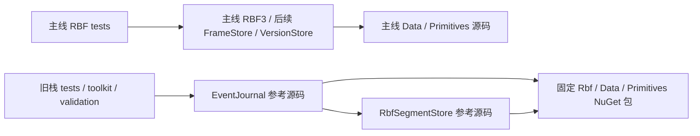

# RBF1 参考代码与主线新栈的过渡方案

日期：2026-10-04。状态：**Implementing**。实施前基线：`9eb27968b6538a5176e49263e2a8f0c6fe5201d3`。

本方案落实本次用户确认的方向：主线投入 `{RBF3, FrameStore, VersionStore}`；现有 `RbfSegmentStore` / `EventJournal` 冻结旧底层依赖，保留为可构建、可测试的参考代码。旧栈的维护与公开交付归 `RBF1` 分支。

## 1. 决策与范围

- 保留旧源码、测试、toolkit 和现有路径，不进行业务或 wire-format 改写。
- 主线 RBF 继续采用 RBF3，并保持既有 RBF1 只读、旧 ticket 兼容合同。
- 旧栈不再消费主线 RBF/Data/Primitives 的源码项目；使用三个已公开包的精确版本范围 `[0.2.0-rbf1-preview.1]`。
- EventJournal 与 RbfSegmentStore 之间保留 ProjectReference；toolkit/validation 经旧栈传递取得冻结的包依赖。
- 旧栈测试移除指向主线 Rbf/Data 的直接 ProjectReference，不引入可切换回新栈的构建开关。
- 当前 solution 保留两组项目及测试。每个测试项目只取得所属依赖图；solution 共存不代表同一消费程序能同时使用两个同名 `Atelia.Rbf` 实现。
- 主线生产包与顺序只在 `eng/Pack.ps1` 注册；本阶段仅为 Primitives → Data → Rbf。两个旧库明确 `IsPackable=false`。
- 本轮不创建 FrameStore/VersionStore 项目，不分库、不迁移磁盘数据、不修改兄弟仓 pin、不推送或公开发布包。

## 2. 包来源与依赖图

NuGet flat-container 当前元数据确认三个底层包均为 `0.2.0-rbf1-preview.1`，repository commit 为 `3e9554e2ea70f769607e80b3fc11a85506050533`。Rbf 包依赖同版本 Data/Primitives。参考代码的依赖版本由一份共享 props 固定，实际 restore 资格必须再检查 assets，不能只看 csproj 文本。

来源：[Rbf 元数据](https://api.nuget.org/v3-flatcontainer/atelia.rbf/0.2.0-rbf1-preview.1/atelia.rbf.nuspec)、[Data 元数据](https://api.nuget.org/v3-flatcontainer/atelia.data/0.2.0-rbf1-preview.1/atelia.data.nuspec)、[Primitives 元数据](https://api.nuget.org/v3-flatcontainer/atelia.primitives/0.2.0-rbf1-preview.1/atelia.primitives.nuspec)。

三个包与主线具有相同程序集身份。依赖隔离发生在项目及消费进程边界；不使用 assembly alias、动态装载或运行时桥接。精确包范围阻止静默升级到主线的新格式实现。

## 3. 交付入口

主线 `Pack`、`Test-Package`、`Verify-Published` 和 GitHub workflow 同步消费三包候选，移除旧栈 selective 发布及额外 segment smoke 入口。旧入口与历史公开发布记录仍可从 RBF1 分支及已发布 tag 查阅。

保留已有独立 PackageReference workspace/cache/config、candidate hash、nuspec/依赖身份、Source Link 和本地源码 checksum 检查。包 smoke 直接引用 Rbf，验证三个包的闭包和当前公开 API；至少覆盖尺寸试算、预算、已知尺寸 ticket、写入读回及冷重开。

`eng/Pack.ps1` 仍要求干净已提交树、明确新版本和输出目录。所有 .NET build/test/pack 串行执行；先源码评审与 Release 测试，再本地提交和三包候选验证。包消费成功不自动扩展为公开发布、Linux、进程终止、性能或旧应用迁移资格。

## 4. 实施与验收顺序

1. 修改旧栈及测试引用、显式关闭旧库 pack，并检查主线源码图未反向取得旧包。
2. 调整三包交付入口、纯 Rbf public 包 smoke、CI 与当前文档导航。
3. 独立审阅依赖图、默认参数、pack/publish 清单及同名程序集的隔离边界。
4. Release solution build；成功后运行匹配配置的完整 solution `--no-build` 测试。
5. 检查旧栈每个 project.assets.json：底层三包均为固定版本 package；新栈三个库与其测试仍消费主线 project；不存在混合 Rbf 来源。
6. 从干净提交构建唯一版本的三包候选，再执行仓外独立 `eng/Test-Package.ps1`。
7. 记录实际提交、测试计数、候选 manifest、public 包依赖来源、隔离消费与未覆盖范围。

若冻结依赖后仍有失败，先按现有 RBF1 合同、fixture 和实际包来源裁决；不通过更改业务语义或跳过原测试制造通过结果。

## 5. 后续退出路径

新栈实施不再要求参考代码适配主线变化。参考实现提供可读的业务故事和独立回归，旧消费者继续使用自己固定的包版本。

以后可在单独维护任务中从 main 删除旧项目及相应测试/toolkit/入口；RBF1 分支保留完整代码与维护历史。只有新栈发布边界、共享基础库和仓库身份已稳定且确有收益时再评估分库，本轮不增加仓库迁移负担。

## 6. 验收记录

本轮源码及引用验证已通过，三包候选验证待执行，状态仍为 Implementing。

- Windows、SDK `10.0.201` / host `10.0.5`；Release solution build：0 errors，41 个既有 XML 注释 warnings。
- 同配置完整 solution `--no-build`：1525/1525，0 failed、0 skipped。Primitives 75、Data 288、RBF 818、SegmentStore 48、EventJournal 174、toolkit 122。
- 构建/测试身份为 `9eb2796 + 本轮配置工作树`，不是后续干净提交的重新构建。212 个构建源码/配置的 SHA256 快照已核对不变；未修改任何现有生产运行时 `.cs` 或单元测试断言。
- 旧栈七个实际 assets 图通过 guard；主线 RBF/Data 测试仍取得源码 project。两个旧测试 host 的 Rbf DLL 与旧包 DLL 哈希一致，与主线 Rbf DLL 不同。
- 三个冻结 RBF1 包已执行 `dotnet nuget verify --all`，签名验证通过；实际 nuspec 版本/来源均吻合。公开包 SHA256：Primitives `84213f5a08135ac4155b5325b6024c80ddf14ad95f75f2826da6c62dd4f54bac`；Data `3388c785de06403322212edfb256ef2dab2fe27eda3fc7849b5e111302eb237b`；Rbf `da52d3ba35ccaf7b0c90ae79ee13acedf92b98ef0a99bec27124ce62251a9358`。
- 实际 MSBuild 属性投影：旧两库 IsPackable=false，主线 Rbf=true。独立审阅无剩余 finding。
- 三包入口 mock 验证通过：默认/显式 All、十项旧参数拒绝、不可变候选复用、七项异常 assets、五项异常 manifest、失败后的环境恢复；这些检查未执行真实包消费。

本地日志、TRX、构建快照和旧包身份在忽略目录 `artifacts/rbf1-reference-transition/`。这些本地工件不是 Git 交付物；可复现命令及结论由本文保存。待干净提交的实际 pack 与隔离消费通过后补齐来源、版本和 workspace，再改为 Accepted。
